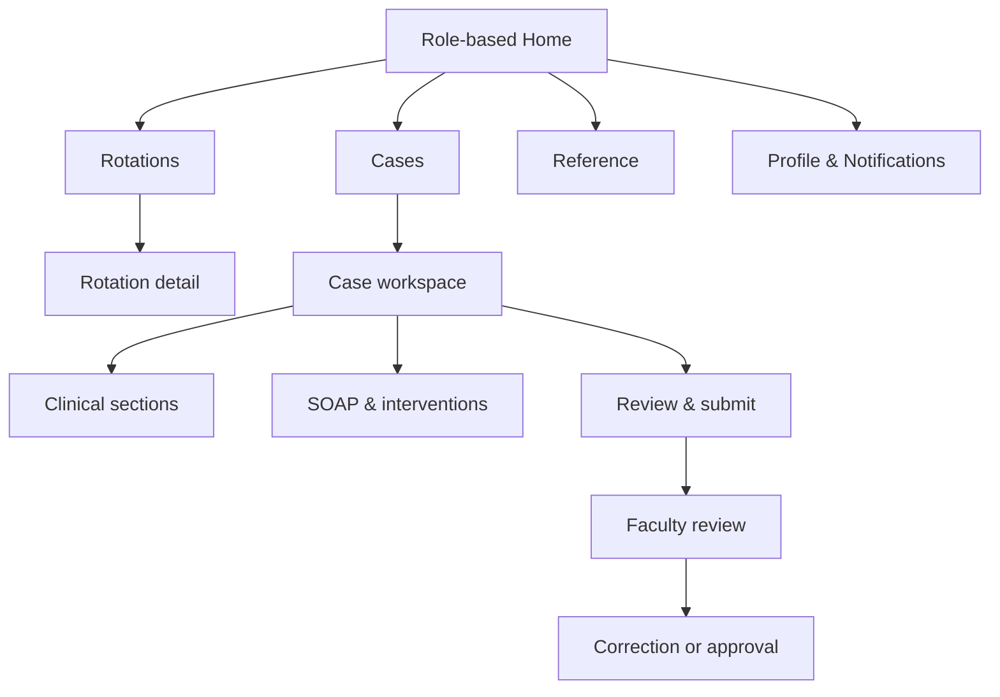
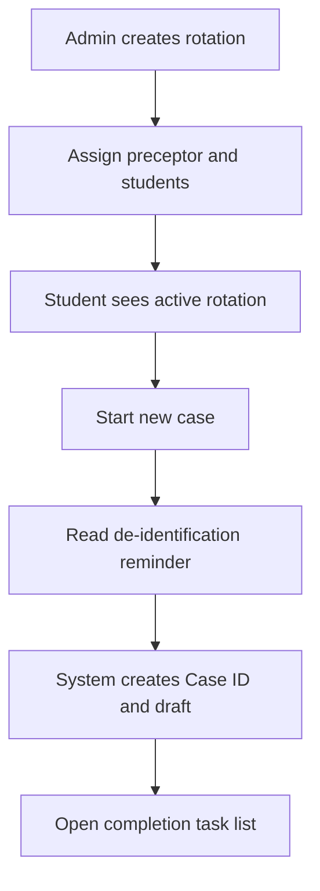
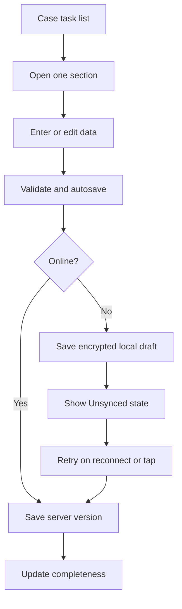
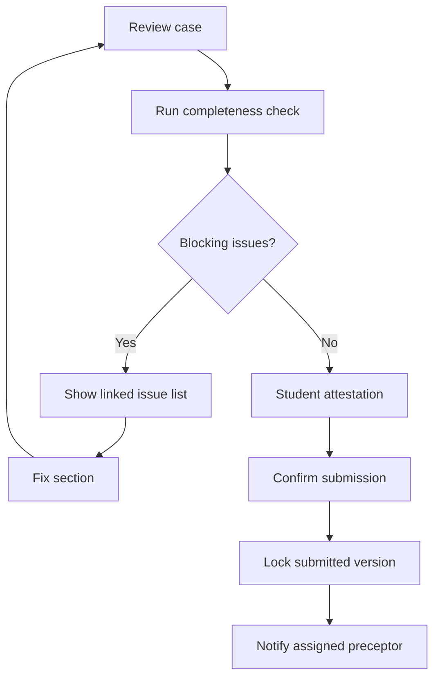
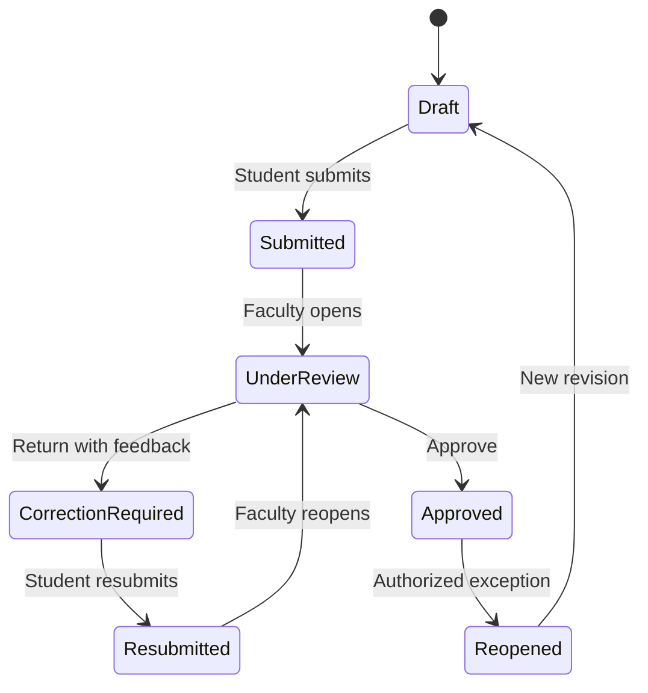
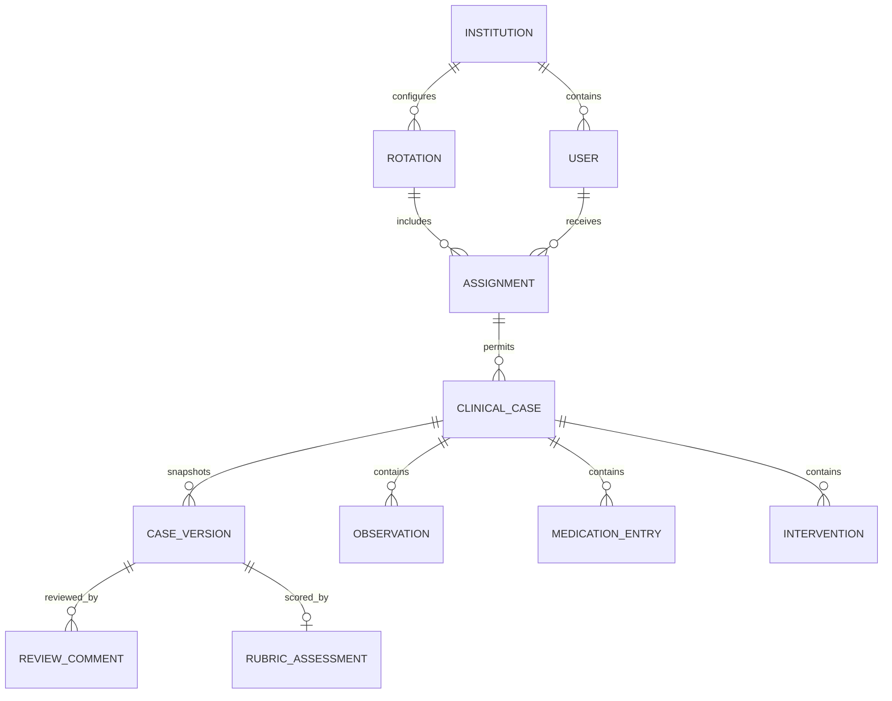

# SIMS Clinical Learning Platform
## Phase 1 Product Research and Implementation Specification

**Status:** Research-backed baseline for institutional validation  
**Audience:** Pharmacy faculty, product/design team, engineering team, institutional leadership  
**Product direction:** Mobile-first clinical documentation and faculty-review platform for Pharm.D, M.Pharm and B.Pharm hospital rotations  
**Fixed stack:** Laravel + Inertia.js + Vue 3 + TypeScript + PostgreSQL  
**Prepared:** 21 September 2026

---

## 1. Executive decision

Phase 1 should deliver one complete, reliable learning loop:

> **Rotation assignment → de-identified case documentation → student self-check → faculty review → correction/resubmission → approval → student portfolio**

This is deliberately narrower than Lexicomp or UpToDate. Those products are mature clinical knowledge systems. Phase 1 should take inspiration from their clarity, structured content and fast retrieval, but should not attempt to reproduce a comprehensive drug database, interaction engine or treatment recommendation system.

The central Phase 1 object is a **student case record**, not a patient electronic medical record. The platform is for supervised learning and assessment. It must never imply that a student entry is an approved clinical order or a substitute for institutional clinical systems.

### Recommended Phase 1 modules

1. Authentication and role-based access
2. Institution, programme, batch, hospital, ward and rotation setup
3. Student-to-preceptor rotation assignment
4. De-identified clinical case workspace
5. SOAP notes
6. Drug-related problem and pharmacist intervention documentation
7. Optional ADR assessment, including a configurable Naranjo form
8. Completeness check and submission
9. Faculty comments, rubric, correction request and approval
10. Student portfolio and basic institutional reports
11. Audit trail, version history and limited offline draft protection

### Explicitly defer

- A comprehensive Lexicomp-like monograph database
- Automated drug–drug interaction clinical decision support
- AI-generated assessments or treatment recommendations
- E-prescribing, medication orders or connection to live hospital EHRs
- Real patient registration or identifiable demographics
- Full FHIR server implementation
- Complex grading analytics, predictive risk scores or benchmarking
- Public API and native mobile apps

---

## 2. Evidence and how it affects the product

| Evidence | Product implication |
|---|---|
| Pharmacy Council of India publishes Pharm.D regulations and the six-year programme framework. Exact logbook/case formats still vary by institution. | Validate Phase 1 fields and grading rules with SIMS faculty before locking the schema. Make case templates configurable. |
| PCNE defines medication review as a structured evaluation of medicines and organizes drug-related problems by problem, cause, intervention, acceptance and outcome. | Preserve this reasoning sequence in the intervention form. Do not reproduce the full PCNE taxonomy for a commercial SaaS without permission. |
| HL7 FHIR Observation separates a result from its code/name, date/time, unit, reference range, interpretation and notes. | Model vitals and labs as structured repeatable records rather than one large text box. Be FHIR-aligned, not FHIR-compliant, in Phase 1. |
| HL7 FHIR distinguishes observations, conditions, allergies and medication statements. | Do not store every clinical item in a generic key/value table. Keep clear domain types. |
| NHS service patterns recommend asking only what is needed, grouping related questions for repeated staff workflows, retaining entered data, and checking answers before submission. | Use focused section screens and a review-before-submit page. Do not use a single enormous form. |
| NHS error guidance requires both a page-level error summary and errors beside fields, with focus sent to the summary. | Build `ErrorSummary` and `InlineError` into the design system from the beginning. |
| OpenMRS and Bahmni support configurable clinical forms, structured records, role permissions and reporting. | Treat templates, permissions and auditability as platform capabilities, not hardcoded page details. |
| IndexedDB supports significant structured local storage, but browser storage may be evicted. Background Sync has limited browser availability. | Offline drafts are a resilience feature, not the source of truth. Always provide manual retry, visible sync status and server version checks. |
| WCAG 2.2 includes target-size and focus requirements. | Use a project target of at least 44 × 44 CSS pixels for primary touch controls and test keyboard/focus behavior. |

### Licensing warning

The PCNE classification page states that commercial use of the classification requires explicit permission. Therefore:

- Phase 1 may use a small, faculty-approved local taxonomy such as **Indication, Effectiveness, Safety, Adherence and Other**.
- The data model may preserve fields for problem, suspected cause, intervention, acceptance and outcome.
- PCNE codes and exact descriptions should be added only after licensing/permission review.

### Research limitation

Public standards and open-source products can define sound patterns, but they cannot determine SIMS-specific curriculum fields, marks, signatures, required case counts or approval authority. Those require a short institutional validation workshop and copies of the current paper forms/logbooks.

---

## 3. Product principles

1. **Learning workflow first.** Every screen should help a student document, reason, receive feedback or demonstrate progress.
2. **De-identification by design.** Do not provide fields for patient name, phone, address, government ID, hospital MRN or full date of birth.
3. **Structured where comparison matters.** Labs, vitals, medications, diagnoses and interventions should be repeatable structured records. Narrative belongs in history and SOAP reasoning.
4. **One clear topic per screen.** Group tightly related questions on the same screen because students repeat this workflow frequently.
5. **Resume safely.** Save locally and to the server, show the state clearly, and never let navigation silently discard work.
6. **Review is a versioned academic event.** Submission locks a version. Corrections create a later version; prior submissions and comments remain readable.
7. **Warnings support judgment; they do not pretend to diagnose.** Use blocking errors only for missing required data, invalid formats, impossible values or workflow conflicts.
8. **Mobile for students, tablet/desktop efficient for faculty.** Both remain responsive, but the primary layouts differ by role.
9. **Clinical status is never shown by color alone.** Pair color with text and an icon.
10. **Phase 1 remains configurable but not a no-code form builder.** Admins select templates and requirements; complex template authoring may follow later.

---

## 4. Users and their jobs

### Student

- See current rotations, ward, preceptor, dates and required work.
- Start or resume a de-identified case quickly during rounds.
- Enter structured clinical data without fighting a desktop-style form.
- Know what is incomplete and what is safely saved.
- Submit a coherent case and respond to faculty corrections.
- See approved work and progress across a rotation.

### Faculty / preceptor

- See cases needing attention, ordered by age or due date.
- Read the case efficiently without opening every edit screen.
- Comment on a section and distinguish required corrections from suggestions.
- Apply a rubric and make an auditable decision.
- Compare a resubmission with the previously reviewed version.
- Monitor student progress without browsing individual cases one by one.

### Institution administrator

- Set up programmes, academic years, batches, hospitals, wards and rotations.
- Import or manage students and faculty.
- Assign students to rotations and preceptors.
- Configure case requirements and review rubrics.
- View operational reports and audit history.

### Out of scope user in Phase 1

There is no separate hospital clinician or patient account. A faculty member may also be a hospital preceptor, but access is still governed through the faculty role and assignment.

---

## 5. Phase 1 information architecture

### Student mobile navigation

Use a persistent bottom navigation with five destinations:

1. **Home**
2. **Cases**
3. **Add** — visually prominent, starts a case only when the student has an active rotation
4. **Reference** — Phase 1 calculators and approved quick references only
5. **Profile**

Notifications open from the top app bar. Rotation detail is reached from Home or Cases; it does not need a permanent bottom-navigation item.

### Faculty navigation

- Mobile: Home, Review, Students, Notifications, Profile
- Tablet/desktop: left sidebar with Dashboard, Review queue, Students, Rotations, Reports

### Admin navigation

Desktop-first sidebar: Dashboard, People, Academic setup, Hospitals & wards, Rotations, Assignments, Templates, Rubrics, Reports, Audit log and Settings.

---

## 6. End-to-end workflows

### 6.1 Rotation and first case

Rules:

- A case belongs to exactly one institution, rotation and student.
- It has one primary reviewing preceptor in Phase 1; optional co-reviewers are deferred.
- The student chooses ward/department only from the active rotation configuration.
- The system generates the case identifier. Do not use a patient name or hospital record number as the identifier.
- Starting a case creates a minimal server draft immediately when online.

### 6.2 Case documentation

Autosave behavior:

- Save after a short idle period, on leaving a field group and before navigating.
- Also provide an explicit **Save draft** action.
- Show one of: `Saving…`, `Saved at 14:32`, `Saved on this device`, `Sync failed—Retry`, or `Conflict—Review changes`.
- Never show a success toast for every autosave; use a quiet persistent status.
- Submission is never queued silently while offline. The student must be online and confirm submission.

### 6.3 Completeness and submission

Student attestation should confirm:

- the case is de-identified;
- the work is the student's own;
- it is submitted for educational review, not as a clinical order.

### 6.4 Faculty review and correction

Rules:

- Opening a submitted case may set it to **Under review**, but only once; reading it again does not create repeated status events.
- Faculty may add comments as `Required correction`, `Suggestion` or `Positive feedback`.
- Returning a case requires at least one unresolved required correction or an overall return reason.
- On return, students may edit sections marked for correction. Faculty can optionally unlock all sections.
- A resubmission preserves the prior version and displays a section-level change summary.
- Approval requires rubric completion when the rotation makes grading mandatory.
- Reopening an approved case requires elevated permission and a reason; it must create an audit event.

### 6.5 Offline conflict

If the student edits Version 7 offline while the server has advanced to Version 8:

1. Do not overwrite Version 8.
2. Show which sections differ.
3. Allow `Use server version`, `Keep my draft as a copy`, or a field/section merge where safely supported.
4. Require the student to resolve the conflict before submission.
5. Record the resolution in the activity history.

Phase 1 may implement section-level replacement rather than a sophisticated field-level merge. This is safer and easier to understand on a phone.

---

## 7. Screen inventory

Priorities: **P0** is required for the first usable institutional pilot. **P1** should be included in Phase 1 if schedule permits. **Later** is intentionally deferred.

### 7.1 Shared and authentication

| ID | Screen | Priority | Purpose and essential UI |
|---|---|---:|---|
| SH-01 | Sign in | P0 | Institution logo, email/ID, password, show password, sign in, forgot password, support link; no role selector. |
| SH-02 | Password reset | P0 | Verified reset flow, password rules, success state and expired-link state. |
| SH-03 | Notifications | P0 | Grouped list for submissions, comments, correction requests, approvals and assignment changes; unread state and deep links. |
| SH-04 | Profile and device drafts | P0 | Name, programme/role, sign out, app version, locally stored unsynced drafts, delete-on-device action with confirmation. |
| SH-05 | Offline fallback | P0 | Explains what is available offline, lists device drafts and provides retry. Do not show a blank browser error. |
| SH-06 | Help and reporting | P1 | De-identification guidance, workflow help, report a problem; exclude any clinical emergency advice. |

### 7.2 Student screens

| ID | Screen | Priority | Purpose and essential UI |
|---|---|---:|---|
| ST-01 | Student home | P0 | Active rotation card, due/returned cases, progress summary, continue last draft, start case, recent feedback. |
| ST-02 | Rotations | P0 | Current and past rotation cards with dates, hospital, ward, preceptor and status. |
| ST-03 | Rotation detail | P0 | Requirements, dates, preceptor, ward, case counts, approved/submitted/draft counts and related cases. |
| ST-04 | Cases list | P0 | Search, status chips, rotation filter, sort by recently updated/due, case cards with sync state and next action. |
| ST-05 | New case | P0 | Active rotation, encounter date, case type/category, age band or age, sex, ward, de-identification reminder and Create draft. |
| ST-06 | Case overview/task list | P0 | Case summary, status, sync indicator, completion meter, required/optional sections, feedback flags, review-and-submit action. |
| ST-07 | Presenting complaint & history | P0 | Complaint list with duration; history of present illness; past medical, medication, family, social and allergy history; `Not known` states. |
| ST-08 | Examination & vitals | P0 | Repeatable vital records with date/time, value and unit; examination narrative; abnormal value confirmation—not diagnostic advice. |
| ST-09 | Diagnoses/problems | P0 | Primary and secondary working diagnoses, status, onset/encounter date and source; allow free text plus approved terminology later. |
| ST-10 | Investigations/labs | P0 | Add result, test name, value/text result, unit, reference range, date/time, interpretation and notes; compact trend/table view. |
| ST-11 | Medication chart | P0 | Repeatable medication cards: generic name, brand optional, strength, dose, route, frequency, indication, start/end or ongoing, source and notes. |
| ST-12 | SOAP note | P0 | Four clearly separated editors, prompts/hints, section word count if configured, save status and previous feedback. |
| ST-13 | Drug-related problem/intervention | P0 | Problem category, evidence/reasoning, suspected cause, proposed intervention, recipient, acceptance, outcome, monitoring and follow-up. |
| ST-14 | ADR assessment | P1 | Suspected medicine/reaction, dates, description, seriousness, action/outcome and configurable Naranjo questionnaire with calculated summary. |
| ST-15 | Counselling & monitoring plan | P1 | Counselling topics, monitoring parameters, target/frequency, responsible person and follow-up. |
| ST-16 | Review and submit | P0 | Read-only case summary, completeness issues, de-identification check, attestation, submit confirmation and online requirement. |
| ST-17 | Case activity & feedback | P0 | Version/status timeline, section comments, filters for unresolved items and deep links back to the relevant section. |
| ST-18 | Correct and resubmit | P0 | Returned summary, required corrections checklist, editable flagged sections, change summary and resubmit confirmation. |
| ST-19 | Portfolio | P1 | Cases by rotation/status, competencies or categories if configured, approved-case view and simple export request. |
| ST-20 | Reference & calculators | P1 | Institution-approved reference links and low-risk calculators; drug monograph/search engine is later. |

### 7.3 Faculty screens

| ID | Screen | Priority | Purpose and essential UI |
|---|---|---:|---|
| FA-01 | Faculty dashboard | P0 | Review queue count, ageing cases, returned/resubmitted cases, rotation progress and recent activity. |
| FA-02 | Review queue | P0 | Filters by status, rotation, ward, student and age; sortable rows/cards; bulk approval is not allowed. |
| FA-03 | Case review reader | P0 | Case header, sticky status/action area, section navigation, readable clinical summary, comment indicators and activity link. |
| FA-04 | Section comment composer | P0 | Comment type, anchored section, text, optional rubric link, save draft and resolve/reopen. |
| FA-05 | Rubric and decision | P0 | Criterion rows, score/level, comments, calculated total where applicable, decision and final feedback. |
| FA-06 | Revision comparison | P0 | Changed-section list, before/after view, student change note, unresolved comment state and current-version indicator. |
| FA-07 | Student progress | P1 | Rotation-level case totals, completion/approval, review turnaround and links to cases; avoid ranking students by default. |
| FA-08 | Rotation roster | P1 | Assigned students, requirement progress, overdue work and contact/action links permitted by policy. |

### 7.4 Administrator screens

| ID | Screen | Priority | Purpose and essential UI |
|---|---|---:|---|
| AD-01 | Admin dashboard | P0 | Active rotations, unassigned users, pending reviews, sync/error indicators and setup shortcuts. |
| AD-02 | Users and roster | P0 | Search/filter, create/edit/deactivate, CSV import with preview and row-level errors, role and batch assignment. |
| AD-03 | Academic setup | P0 | Programmes, years, batches and courses; archive instead of destructive deletion when referenced. |
| AD-04 | Clinical sites | P0 | Hospitals, departments and wards; active/inactive state. |
| AD-05 | Rotations | P0 | Dates, site/ward, programme/batch, capacity, requirements, status and duplicate-from-existing. |
| AD-06 | Rotation assignments | P0 | Student and preceptor assignment, conflict/overlap warnings, confirmation and audit history. |
| AD-07 | Case templates | P1 | Select required sections and fields, labels, help text and case categories; no unrestricted arbitrary scripting. |
| AD-08 | Rubrics | P1 | Criteria, levels/scores, required comments, total and effective date; version the rubric after use. |
| AD-09 | Reports | P1 | Operational filters and CSV/PDF export: rotation progress, review ageing, approved case counts and intervention categories. |
| AD-10 | Audit log | P0 | Actor, action, object, date/time, IP/device metadata where policy permits, before/after reference and reason. |

---

## 8. The case workspace in detail

The case workspace is the most important UX decision in Phase 1.

### 8.1 Overview instead of one long wizard

The overview displays a task list:

| Section | Example status | Blocking? |
|---|---|---:|
| Case details | Complete | Yes |
| History | In progress | Yes |
| Examination & vitals | Complete | Configurable |
| Diagnoses | Not started | Yes |
| Labs | Optional / Complete | Configurable |
| Medication chart | 6 medicines | Yes |
| SOAP note | In progress | Yes |
| Interventions | None recorded / Complete | Configurable |
| ADR assessment | Not applicable | No or configurable |
| Counselling & monitoring | Optional | No or configurable |

Each row includes status, short summary, feedback count and chevron. A sticky footer shows the next recommended action, but students can open sections in any order.

Why this pattern:

- Clinical data rarely arrives in the same order every time.
- Students may return to a case after rounds.
- It exposes completion and feedback without forcing many Next/Back steps.
- It works well on a phone and scales to configurable templates.

### 8.2 Section editor pattern

Every section screen should contain:

1. Back link to case overview
2. Case ID and section title
3. Any de-identification or educational hint
4. Existing faculty feedback for this section
5. Field groups or repeatable items
6. Inline validation
7. Persistent save/sync status
8. Primary action `Save and return to case`
9. Secondary action `Save draft`

Use `Continue` only inside a small subflow such as adding a medication. Do not label buttons vaguely as `Next`.

### 8.3 Repeatable clinical items

On mobile, show saved items as readable cards. The Add action opens a full-screen subflow for complex entries such as medications or interventions. Do not put 10 medication fields in a small modal.

On tablet/desktop, a compact table can be used when it remains readable. Editing may open a right-side drawer or dedicated screen. Always offer the same information in a responsive card form; do not require horizontal scrolling for the main task.

---

## 9. Field and validation baseline

Final required/optional rules must be confirmed by faculty. The following is the safe product baseline.

### 9.1 Case details and privacy

Collect:

- Generated Case ID
- Rotation, site, department/ward
- Encounter date or date range
- Case category
- Age or age band, as institutionally approved
- Sex/gender field only if educationally needed and defined by policy
- Admission type or care setting, if needed

Do not collect:

- Patient name or initials if they can identify the person in a small ward
- Full date of birth
- Phone, email or address
- Aadhaar, government ID, insurance number
- Hospital MRN/registration number
- Identifiable images, scanned notes or discharge summaries in Phase 1

Provide a persistent warning when narrative text resembles an identifier. Pattern checks may flag phone numbers, email addresses, long ID-like numbers and labels such as `Patient name:`. This is a warning and review aid, not a guarantee of de-identification.

### 9.2 Vitals

Suggested structured types:

- Temperature and unit
- Pulse/heart rate per minute
- Respiratory rate per minute
- Blood pressure systolic/diastolic in mmHg
- Oxygen saturation percentage
- Height in cm
- Weight in kg
- Pain score and scale, if required
- Date/time and source/notes

Do not block merely unusual clinical values. For extreme or unlikely values, ask the student to confirm the entry and allow a note. Block only impossible formats such as negative weight or invalid time.

### 9.3 Labs and investigations

Each result should support:

- Test name
- Numeric or textual result
- Unit
- Reference range as displayed by the source laboratory
- Collected/result date and time
- Interpretation: low, normal, high, critical, abnormal or unknown
- Source and note

Do not hardcode a single global normal range for every hospital, population and method. A result may be flagged automatically only when a numeric value and applicable range are available; the original captured range remains visible.

### 9.4 Medication chart

Each medicine should support:

- Generic/ingredient name; autocomplete with free-text fallback
- Brand name optional
- Dosage form and strength
- Dose and dose unit
- Route
- Frequency or schedule
- Indication
- Start date, stop date or ongoing
- Current, prior, held or discontinued status
- Source and notes

Keep dose as separate value and unit fields to support later calculations. Preserve the exact student-entered text if normalized terminology is added later.

### 9.5 SOAP

- **Subjective:** symptoms, concerns, adherence and patient-reported context
- **Objective:** measurable findings, labs, vitals and documented medication information
- **Assessment:** clinical reasoning and prioritized drug-related issues
- **Plan:** proposed intervention, monitoring, counselling and follow-up

Provide prompts as collapsible help, not placeholder text that disappears. Do not auto-generate clinical content in Phase 1.

### 9.6 Intervention

Use a simple institution-approved taxonomy:

- Indication
- Effectiveness
- Safety
- Adherence
- Other

Structured sequence:

1. Problem/category
2. Evidence and rationale
3. Suspected cause
4. Proposed or completed intervention
5. Recipient: prescriber, nurse, patient/caregiver, faculty or other
6. Acceptance: accepted, partially accepted, not accepted, pending or unknown
7. Outcome: resolved, improved, unchanged, worsened, prevented/potential, pending or unknown
8. Monitoring and follow-up

Use `Proposed` versus `Communicated/completed` explicitly so a student's educational recommendation is not mistaken for an implemented clinical action.

### 9.7 ADR and Naranjo

The Naranjo form should:

- display each question and permitted answer;
- show the assigned score transparently;
- calculate the total deterministically;
- show the category with a disclaimer that it is an educational causality aid;
- allow faculty to review responses and reasoning;
- version the scoring configuration.

Do not treat the calculated category as a confirmed diagnosis. WHO-UMC should remain a later option unless faculty specifically require it and the implementation guidance is reviewed.

---

## 10. Component system

### 10.1 Foundations

| Component | Required behavior |
|---|---|
| `AppShell` | Role-aware mobile bottom navigation or tablet/desktop sidebar; main landmark and skip link. |
| `PageHeader` | Back link, title, supporting context, status and at most one primary action. |
| `SectionCard` | Consistent spacing, heading hierarchy and optional action area. |
| `Button` / `IconButton` | Clear primary/secondary/destructive hierarchy; loading and disabled reason; touch target ≥44 px. |
| `StatusBadge` | Text + icon + color; stable status vocabulary. |
| `Field`, `Input`, `Textarea` | Persistent label, optional hint, required indicator, error association and correct mobile keyboard. |
| `Select` / `Combobox` | Search for long lists; explicit empty/no-result states; free text only where allowed. |
| `UnitInput` | Separate numeric value and controlled unit; supports decimal input. |
| `DateTimeField` | Locale-readable display, clear timezone behavior and sensible defaults without silently guessing. |
| `ErrorSummary` | Receives focus on failed submit; links to each invalid field. |
| `InlineError` | Specific problem and correction, not just `Invalid`. |
| `SummaryList` | Label/value review display with Change links where editable. |
| `ResponsiveDataList` | Table on wide screens, cards on mobile; same accessible information. |
| `Dialog` | Confirmation only; focus trap, labelled title and safe default. |
| `BottomSheet` | Short mobile choices/actions, not complex clinical forms. |
| `Toast` | Noncritical transient confirmation; never the only place errors or sync status appear. |
| `Skeleton` | Mirrors actual layout; use for initial loading only. |
| `EmptyState` | Explain why empty and offer the permitted next action. |
| `StickyActionBar` | Keeps primary action reachable without obscuring content or the mobile keyboard. |

### 10.2 Workflow components

| Component | Required behavior |
|---|---|
| `CaseTaskList` | Section status, completion, comments and navigation. |
| `CompletionMeter` | Numeric/label summary; never rely only on a circular graphic. |
| `AutosaveStatus` | Saving, saved time, local-only, error and conflict states. |
| `OfflineBanner` | Persistent but compact; explains current capability and links to pending drafts. |
| `SubmissionChecklist` | Blocking issues first; each item links to its section. |
| `StatusTimeline` | Who changed state, when and why; distinguishes system and human events. |
| `CommentThread` | Type, author, date, section, reply/resolution state; comments cannot be silently deleted. |
| `RevisionDiff` | Changed sections first; before/after values with accessible added/removed labels. |
| `RubricMatrix` | Criteria, level/score, comment and total; keyboard accessible. |
| `ConfirmAction` | Consequence-focused confirmation for submit, return, approve, reopen and delete-local-copy. |

### 10.3 Clinical components

| Component | Required behavior |
|---|---|
| `CaseIdentityCard` | Case ID, age/sex if allowed, ward, encounter and status; never patient name. |
| `DeidentificationNotice` | Short warning plus expandable examples; shown at case creation and submission. |
| `VitalGrid` | Fast numeric entry, unit and time; confirmation for unlikely values. |
| `LabResultCard` / `LabTrend` | Result, unit, range, date and interpretation; table/card alternatives. |
| `MedicationCard` | Name, dose, route, frequency, status and indication; prominent edit action. |
| `SOAPEditor` | Four separate fields, guidance and per-section feedback. |
| `InterventionForm` | Structured reasoning sequence and implementation status. |
| `ADRForm` | Suspect medicine, reaction timeline, action and outcome. |
| `NaranjoQuestionnaire` | Answer choices, transparent score, result and disclaimer. |
| `MonitoringPlan` | Parameter, target, frequency, duration, responsible person and follow-up. |
| `FacultyCommentMarker` | Badge/anchor on affected section without covering content. |

---

## 11. UI and interaction specification

### 11.1 Responsive layout

| Viewport | Recommended behavior |
|---|---|
| Phone | Single column; 16 px horizontal gutter; bottom navigation; full-screen item editors; sticky primary action. |
| Tablet portrait | Single main column with wider cards; optional case section rail; bottom nav or compact rail. |
| Tablet landscape | Case content plus section navigation; faculty may use review content + comments panel. |
| Desktop | Sidebar navigation; constrained reading width; two-pane faculty review; admin data tables with filters. |

Keep narrative reading width near 70–80 characters. Dense clinical lists may be wider, but explanatory text should not span the entire desktop.

### 11.2 Visual direction

- Primary: SIMS navy or another approved dark blue
- Accent: restrained turmeric/gold for identity and emphasis, not warning status
- Surface: white and neutral gray
- Error/critical: red with icon and text
- Warning/returned: amber with icon and text
- Success/approved: green with icon and text
- Information/submitted: blue with icon and text
- Typography: highly legible sans serif such as Public Sans or approved institutional equivalent
- Spacing: 4/8 px base scale
- Corners: moderate 8–12 px; avoid exaggerated consumer-fintech styling
- Motion: brief and functional; respect reduced-motion settings

The desired feel is calm, clinical and modern—not decorative. Information density may increase on tablet for review, while phone screens should favor legibility and thumb reach.

### 11.3 Button labels

Use concrete actions:

- `Create case`
- `Add medication`
- `Save and return to case`
- `Review case`
- `Submit for review`
- `Return for correction`
- `Approve case`
- `Resolve comment`
- `Retry sync`

Avoid `Submit` when multiple submissions exist on the page, `Next`, `OK`, or icon-only destructive actions.

### 11.4 Destructive or irreversible actions

- Deactivate rather than delete referenced users, rotations, templates and rubrics.
- Removing an unsynced device draft needs a confirmation that states it cannot be recovered from the server.
- Submit, approve, return and reopen confirmations must name the consequence.
- No bulk approval of clinical cases.

---

## 12. Complete state coverage

Every P0 screen must be designed and tested for more than the happy path.

| State | Required behavior |
|---|---|
| Loading | Skeleton or progress text; prevent duplicate primary action. |
| Empty | Explain why and present the permitted next action. |
| Validation error | Error summary + inline error; entered data remains. |
| Server error | Plain-language explanation, retry and support/reference code; no data loss. |
| Unauthorized | Explain missing assignment/permission; do not reveal restricted data. |
| Read-only | State why: submitted, approved, past rotation or insufficient permission. |
| Saving | Quiet persistent indicator. |
| Saved | Timestamp and destination where helpful. |
| Offline/local-only | Banner + item-level state; manual retry. |
| Sync conflict | Block submission, identify changed sections and offer safe resolution. |
| Stale data | Warn before overwriting; reload or compare. |
| Returned | Display required corrections before general content. |
| Approved | Read-only approved version and faculty decision/rubric. |
| Archived/inactive | Remains readable to authorized users; clearly labelled. |

---

## 13. Permissions and workflow rules

### Student

- May create cases only within an active assigned rotation.
- May edit own draft and returned case sections permitted by the reviewer.
- May read own submitted, returned and approved cases.
- Cannot change faculty comments, rubric scores, status history or another student's case.
- Cannot approve or reopen a case.

### Faculty

- May see cases only for assigned rotations/students unless granted a programme-level role.
- May comment, score, return and approve submitted/resubmitted cases.
- Cannot silently edit student clinical content. If factual correction is needed, return it or add a clearly attributed faculty note.
- May reopen approved cases only with permission and a recorded reason.

### Admin

- Manages configuration and assignments.
- Does not automatically gain permission to alter student clinical content or faculty review decisions.
- May view case content only if institutional policy grants it; separate operational administration from academic review where possible.

Authorization must be enforced by Laravel policies/server-side checks. Hiding a button in Vue is not authorization.

---

## 14. Audit and versioning

Record at minimum:

- Case created
- Section saved, including version identifier
- Submission and resubmission
- Faculty opened review
- Comment created, edited, resolved or reopened
- Rubric saved
- Case returned, approved or reopened
- Assignment or reviewer changed
- Local/server conflict resolved
- Export generated
- Administrative configuration changed

Audit events should include actor, role, timestamp, institution, action, object ID, previous/new version reference and reason where required. Avoid placing raw sensitive clinical text in generic application logs.

Version model recommendation:

- Mutable working draft with optimistic concurrency version
- Immutable submission snapshot
- Review/comments reference snapshot and section
- Returned working revision derived from the snapshot
- Immutable approved snapshot

---

## 15. Offline and PWA boundary

### Include in Phase 1

- Installable PWA shell
- Cached application shell and static assets
- Access to explicitly stored de-identified working drafts on the same authenticated device
- IndexedDB outbox for section saves
- Visible network and sync status
- Manual `Retry sync`
- Idempotent save endpoints and optimistic concurrency checks
- Clear data removal on sign-out or an institution-defined secure retention policy

### Do not promise in Phase 1

- Complete offline access to all cases
- Offline faculty approval or student submission
- Reliable background sync on every browser
- Offline access to continuously changing drug knowledge
- Indefinite local persistence

Implementation note: use Background Sync as an enhancement only. The foreground application must retry when opened or reconnected because Background Sync is not supported in all widely used browsers.

---

## 16. Accessibility and clinical usability checklist

- Semantic headings and one main landmark
- Skip link on desktop/tablet layouts
- Visible keyboard focus, including drawers and dialogs
- Touch targets at least 44 × 44 CSS pixels for primary controls
- Labels remain visible after entry
- Required status conveyed in text, not only an asterisk
- Status and abnormal values use text/icon as well as color
- Errors identify what happened and how to fix it
- Error summary receives focus and links to the relevant field
- Logical tab order and no keyboard traps
- Screen-reader announcements for save, sync failure and status change without excessive chatter
- Tables have headings; mobile card alternatives preserve labels
- Zoom/reflow tested at 200% and narrow widths
- Reduced-motion preference honored
- Do not time out active form entry without warning and recovery
- Plain language; expand clinical abbreviations where ambiguity is possible

---

## 17. Data model direction

The specification does not require a complete schema yet, but these boundaries should shape it:

Additional first-class entities should include diagnosis/problem, allergy, SOAP note, ADR assessment, status transition, audit event, case template and rubric version.

Use UUIDs or ULIDs for externally exposed identifiers. Every tenant-owned table needs institution scoping. Add database constraints as well as application validation for critical relationships.

### FHIR alignment—not a Phase 1 FHIR claim

- Observation-inspired vitals/labs
- MedicationStatement-inspired medication history
- Condition-inspired diagnosis/problem
- AllergyIntolerance-inspired allergy/adverse reaction history
- Questionnaire-inspired scored assessments
- AuditEvent-inspired audit records

Internal data should be capable of mapping later, but full conformance requires profiles, terminology binding, validation and interoperability testing beyond Phase 1.

---

## 18. Technical implications for Laravel + Inertia + Vue

### Laravel

- Authentication, tenant scoping and policies
- Form Request validation with stable error keys
- Explicit workflow transition service; do not scatter status changes across controllers
- Database transactions for submission, return, approval and assignment changes
- Immutable snapshot/version service
- Audit event service
- Queued notifications and report generation
- Rate limiting and secure download authorization

### Inertia

- Server-driven routes and authorization remain the source of truth
- Vue page state and form helpers provide the app-like experience
- Preserve entered form state after validation failures
- Use partial reload/deferred data where appropriate for dashboards
- Complex offline saving requires a dedicated client-side draft/outbox layer; Inertia alone is not an offline architecture

### Vue 3 + TypeScript

- Reusable field, workflow and clinical components
- Typed form/domain models
- Case workspace state machine/composable
- IndexedDB adapter and sync queue
- Accessibility behaviors for focus and live regions
- Component-level and interaction tests

### PostgreSQL

- Relational integrity for rotations, assignments, cases and reviews
- JSONB only for bounded template configuration or frozen snapshot payloads—not as a replacement for all clinical tables
- Optimistic lock/version column on mutable drafts
- Indexed tenant, status, assignment and updated-at fields

---

## 19. Analytics for the pilot

Measure product operation, not clinical efficacy:

- Time from case creation to first saved section
- Draft completion rate
- Most common blocking validation issues
- Cases submitted, returned, resubmitted and approved
- Median review turnaround
- Required correction count by section
- Sync failures and conflict rate
- Form abandonment and resume rate
- Device/viewport distribution
- Accessibility/usability defects reported

Do not create student leaderboards. Analytics should help improve the workflow and identify support needs, not imply educational quality from raw case counts.

---

## 20. Research and validation gate before coding clinical forms

Conduct a 60–90 minute workshop with 2–3 faculty/preceptors, 4–6 students and one administrator. Collect:

1. Current paper/digital case history form
2. SOAP note format and examples
3. Intervention/DRP form and categories
4. ADR/Naranjo requirements
5. Rotation logbook and required case counts
6. Rubric, marks and approval/signature rules
7. Required exports/reports
8. Hospital data-handling or de-identification policy
9. Device/connectivity conditions in wards
10. Terminology and abbreviations used locally

Workshop decisions to document:

- Required versus optional sections by programme and rotation
- Whether age or age band is permitted
- Who may review/approve and whether a second approval is needed
- Whether a returned case unlocks flagged sections or all sections
- Rubric scoring and pass rules
- Case due dates and late-submission behavior
- Which calculators/references are safe and necessary in Phase 1
- Retention and local-device clearing rules

The P0 shell, roles and rotation setup can begin while this workshop is scheduled. The final clinical field schema should not be frozen before reviewing the institution's forms.

---

## 21. Usability test tasks

Prototype and test these scenarios before full build:

### Student

1. Find the active rotation and start a case.
2. Add a medication and one lab result on a phone.
3. Leave midway, return and identify whether work is saved.
4. Complete a SOAP note and intervention.
5. Find and fix three submission issues.
6. Understand a returned case and resubmit only corrected sections.
7. Recover from loss of connectivity and a sync error.

### Faculty

1. Find the oldest unreviewed case.
2. Read a case and comment on the medication chart.
3. Mark one issue as required and another as a suggestion.
4. Complete the rubric and return the case.
5. Compare the resubmission and approve it.

### Admin

1. Import students with one invalid row.
2. Create a rotation and assign students/preceptor.
3. Identify an overlap/conflict.
4. Update a rubric without altering historical assessments.

Pilot success targets should be agreed locally, but zero critical data-loss errors and zero unidentified permission leaks are release requirements.

---

## 22. Phase 1 acceptance gates

### Product and workflow

- Student can complete the entire loop from assigned rotation to approved case.
- Every status transition has an owner, condition and recorded event.
- Returned and resubmitted versions remain distinguishable.

### Clinical and academic

- Faculty approves field definitions, terminology, rubric and reports.
- The platform distinguishes educational proposal from implemented clinical action.
- No automated recommendation is presented as clinical truth.

### Privacy and security

- Prohibited identifiers are absent from the standard form.
- Tenant isolation and record-level policies pass automated tests.
- Exports, notifications and logs do not leak case content.
- Institutional/legal review confirms retention, hosting and consent/notice requirements.

### Reliability

- Autosave and manual save are recoverable under tested network failures.
- Conflicts never silently overwrite newer server data.
- Submission/approval operations are idempotent and transactional.

### Accessibility

- Keyboard and screen-reader critical flows pass review.
- Error summary, focus, touch targets, contrast and responsive reflow meet the chosen WCAG 2.2 AA target.

### Quality

- Permission, workflow transition and versioning tests cover negative cases.
- Pilot users complete core tasks on representative low/mid-range Android phones and tablets.

---

## 23. Recommended build sequence

| Slice | Outcome |
|---:|---|
| 0 | Validate institutional forms, taxonomy, rubric, privacy and reports. |
| 1 | Laravel/Inertia/Vue foundation, design tokens, authentication, tenant scoping and RBAC. |
| 2 | Admin academic/site setup, users and rotation assignments. |
| 3 | Student shell, dashboards, rotations and cases list. |
| 4 | Case creation, overview/task list, server drafts, version checks and autosave UI. |
| 5 | Clinical sections: history, vitals, diagnoses, labs and medication chart. |
| 6 | SOAP, intervention and configurable ADR/Naranjo. |
| 7 | Completeness, review summary, attestation, submission and immutable snapshots. |
| 8 | Faculty queue, reader, comments, rubric, return, resubmission diff and approval. |
| 9 | Portfolio, operational reports, notifications and audit viewer. |
| 10 | PWA shell, IndexedDB outbox, manual sync/recovery and conflict experience. |
| 11 | Accessibility, security, performance and pilot usability hardening. |

Start development with a **walking skeleton**: one admin creates one rotation, assigns one student and faculty member, the student creates a minimal case, submits it, and faculty approves it. Then deepen the clinical sections without waiting until the end to discover workflow/versioning problems.

---

## 24. What to borrow—and what not to copy

### From Lexicomp / UpToDate-style products

Borrow:

- Strong search hierarchy
- Structured, scannable content
- Clear evidence/source and last-reviewed metadata
- Consistent clinical headings
- Conservative visual language

Do not copy:

- Proprietary content, interaction data or exact layouts
- Comprehensive knowledge-engine scope in Phase 1
- Any appearance that the student platform is a licensed replacement

### From OpenMRS / Bahmni

Borrow:

- Configurable forms
- Structured observations
- Clear patient/case summary patterns
- Roles, auditability and reporting
- Separation of domain records rather than a single note blob

Do not copy:

- Full hospital registration, billing, ordering or inpatient workflow
- Desktop-heavy density without adaptation for student phones

### From Mobbin or other pattern libraries

Use them during visual design for general patterns such as task lists, review screens, bottom navigation, autosave status and search/select. Pattern libraries are visual references, not clinical requirements. Screens should be recreated from first principles using the verified workflow and SIMS design system, not copied.

---

## 25. Sources reviewed

Primary and authoritative sources:

- Pharmacy Council of India, **Pharm.D Regulations**: https://pci.gov.in/en/pharmd-regulations/
- Pharmaceutical Care Network Europe, **Medication Review**: https://pcne.org/working-groups/medication-review/
- Pharmaceutical Care Network Europe, **Drug-Related Problems Classification and licensing notice**: https://pcne.org/working-groups/pcne-working-group-on-drug-related-problems/
- HL7 FHIR R4, **Observation**: https://hl7.org/fhir/R4/observation.html
- HL7 FHIR R4, **MedicationStatement**: https://hl7.org/fhir/R4/medicationstatement.html
- HL7 FHIR R4, **Questionnaire**: https://hl7.org/fhir/R4/questionnaire.html
- HL7 FHIR R4, **AuditEvent**: https://hl7.org/fhir/R4/auditevent.html
- NHS Design System, **Layout**: https://service-manual.nhs.uk/design-system/styles/layout
- NHS Design System, **Question pages**: https://service-manual.nhs.uk/design-system/patterns/question-pages
- NHS Design System, **Check answers**: https://service-manual.nhs.uk/design-system/patterns/check-answers
- NHS Design System, **Task list**: https://service-manual.nhs.uk/design-system/components/task-list
- NHS Design System, **Error summary**: https://service-manual.nhs.uk/design-system/components/error-summary
- W3C WAI, **WCAG 2.2 Target Size (Minimum)**: https://www.w3.org/WAI/WCAG22/Understanding/target-size-minimum.html
- OpenMRS, **Product and EMR features**: https://openmrs.org/product/
- OpenMRS, **Core repository**: https://github.com/openmrs/openmrs-core
- Bahmni, **Feature list**: https://www.bahmni.org/feature-list/
- Bahmni, **Clinical frontend repository**: https://github.com/Bahmni/openmrs-module-bahmniapps
- Medplum, **Open-source repository and FHIR platform architecture**: https://github.com/medplum/medplum
- MDN, **IndexedDB API**: https://developer.mozilla.org/en-US/docs/Web/API/IndexedDB_API
- MDN, **Background Synchronization API**: https://developer.mozilla.org/en-US/docs/Web/API/Background_Synchronization_API
- Inertia.js, **Forms and validation**: https://inertiajs.com/forms and https://inertiajs.com/validation
- Laravel, **Authorization**: https://laravel.com/docs/authorization

### Source-handling note

This document uses public source material to derive product patterns. It does not reproduce proprietary Lexicomp, UpToDate, Clinirex or Mobbin content. Before launch, counsel or an appropriately authorized institutional reviewer should verify current privacy, medical-content, licensing and regulatory obligations for the intended deployment jurisdictions.

---

## 26. Final recommendation

Phase 1 is ready to move into **institutional validation and low-fidelity design**, not directly into coding every clinical form.

The next concrete deliverables should be:

1. A signed-off field/rubric decision sheet from the validation workshop
2. Mobile wireframes for ST-01, ST-05, ST-06, ST-11, ST-12, ST-13, ST-16 and ST-18
3. Tablet/desktop wireframes for FA-02, FA-03, FA-05 and FA-06
4. A workflow state-transition table and permission matrix
5. The Laravel domain schema and route/page map
6. A walking-skeleton implementation before clinical form expansion

This sequence keeps the product clinically grounded while allowing the fixed Laravel + Inertia + Vue stack to begin delivering usable software quickly.
