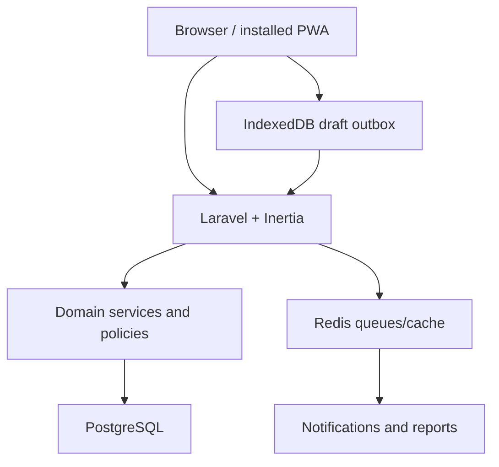

# Pharmalab Phase 1 Architecture

## 1. Architecture decision

Pharmalab uses a modular Laravel monolith with Inertia.js and Vue 3. Laravel owns routing, authentication, authorization, validation, workflow transitions and persistence. Vue provides the app-like responsive interface. PostgreSQL is the system of record.

This structure is appropriate for Phase 1 because the workflows are strongly relational and share one authorization model. It avoids the overhead of an API-first split while preserving service boundaries that can later support an API or native client.

## 2. High-level topology



## 3. Logical modules

| Module | Responsibilities |
|---|---|
| Identity | Authentication, password reset, session security and user activation. |
| Tenancy | Institution context, tenant scoping and institution settings. |
| Academic setup | Programmes, academic periods, batches and case requirements. |
| Clinical sites | Hospitals, departments and wards. |
| Rotations | Rotation configuration, assignments and active-period rules. |
| Cases | Case ownership, details, sections, completeness and locking. |
| Clinical records | History, observations, diagnoses, allergies, medications, SOAP, interventions and ADR assessments. |
| Submission | Immutable snapshots, attestations and resubmission versions. |
| Review | Queue, comments, rubric assessment, return and approval decisions. |
| Portfolio | Approved work and student progress summaries. |
| Notifications | In-app and queued notification delivery. |
| Reporting | Operational queries and authorized exports. |
| Audit | Append-only activity and security-relevant events. |
| Offline sync | Draft payloads, idempotency, optimistic concurrency and conflicts. |

## 4. Suggested application structure

```text
app/
├── Actions/
│   ├── Cases/
│   ├── Reviews/
│   ├── Rotations/
│   └── Sync/
├── Domain/
│   ├── Cases/
│   ├── Reviews/
│   └── Rotations/
├── Enums/
├── Events/
├── Http/
│   ├── Controllers/
│   ├── Middleware/
│   └── Requests/
├── Jobs/
├── Models/
├── Notifications/
├── Policies/
├── Queries/
└── Services/

resources/js/
├── Components/
│   ├── Clinical/
│   ├── Forms/
│   ├── Layout/
│   └── Workflow/
├── Composables/
├── Layouts/
├── Pages/
│   ├── Admin/
│   ├── Auth/
│   ├── Faculty/
│   ├── Shared/
│   └── Student/
├── Stores/
├── Types/
└── offline/
```

Folders express responsibility; they do not require a separate package for every module in Phase 1.

## 5. Request lifecycle

1. Laravel resolves authenticated user and institution context.
2. Policy authorizes the resource/action.
3. Form Request validates input.
4. Controller delegates the use case to an Action or domain service.
5. Domain service enforces transition and transactional rules.
6. Models persist changes in PostgreSQL.
7. Audit event is appended in the same transaction when required.
8. Notifications/reports are queued after commit.
9. Inertia returns the page or redirects with flash data and validation errors.

Controllers should remain thin. Workflow rules must not be implemented only in Vue components.

## 6. Tenant and authorization model

- Every institution-owned record carries `institution_id` directly or has a constrained parent relationship.
- Global query scopes may reduce accidental leakage, but policies and explicit query boundaries remain required.
- Students are authorized through case ownership plus active assignment.
- Faculty are authorized through assigned rotation/student scope or an explicit programme-level permission.
- Administrators manage configuration; they do not automatically edit academic review content.
- Vue receives capabilities such as `can.edit` and `can.review` for presentation only. Laravel policies make the decision.

## 7. Workflow architecture

Case status changes use one transition service and explicit commands such as:

- `SubmitCase`
- `StartCaseReview`
- `ReturnCaseForCorrection`
- `ResubmitCase`
- `ApproveCase`
- `ReopenApprovedCase`

Each command checks current state, actor, assignment, required data and version. It executes inside a database transaction and emits a domain/audit event.

Status is not changed with unrestricted generic model updates.

## 8. Versioning strategy

- A working case draft is mutable and has an optimistic-lock version.
- Submission serializes an immutable snapshot of the case and its clinical sections.
- Review comments and rubric assessment reference the submitted case version.
- A returned case creates or activates a new working revision derived from the last submission.
- Resubmission creates another immutable snapshot.
- Approval applies to one explicit immutable version.

Structured source tables remain queryable. Snapshot payloads may use JSONB because their purpose is to preserve the exact reviewed representation.

## 9. Offline and synchronization architecture

Phase 1 supports limited draft resilience rather than complete offline operation.

### Client

- IndexedDB stores explicitly allowed de-identified draft sections.
- Each pending operation has a client operation ID, case ID, base server version, section type, payload and timestamp.
- Foreground reconnect attempts synchronization.
- Background Sync may be used as an enhancement, never as the only retry mechanism.

### Server

- Sync endpoint is authenticated, authorized and rate limited.
- Client operation ID makes retries idempotent.
- Base version enforces optimistic concurrency.
- Server returns saved version or a conflict response with changed-section metadata.
- Submission and approval require a current online server state.

## 10. Queue and cache use

Redis may support:

- Notification delivery
- Report/export generation
- Rate limiting
- Short-lived reference and dashboard caching

Do not cache authorization results across users. Do not use Redis as the source of truth for case workflow state.

## 11. Security baseline

- Secure cookies, CSRF protection and session rotation
- Password hashing through Laravel defaults
- Rate limits for sign-in, reset and sync endpoints
- Server-side validation and output escaping
- Policy checks for every case, review and export action
- Database transactions and constraints for critical relationships
- Append-only audit records
- Sensitive content excluded from ordinary logs and notification previews
- File uploads excluded from the first pilot unless separately designed and scanned
- Dependency and secret scanning in CI

## 12. Testing architecture

| Layer | Focus |
|---|---|
| Unit | Transition rules, completeness logic, scoring and calculations. |
| Feature | Authentication, policies, validation, tenant isolation and transactional actions. |
| Component | Vue fields, task list, sync state, comments and rubric interactions. |
| End-to-end | Walking skeleton, return/resubmit, offline recovery and critical role boundaries. |
| Accessibility | Automated checks plus keyboard/screen-reader manual scenarios. |

Use factories with at least two institutions in authorization tests to detect cross-tenant leakage.

## 13. Observability

- Structured application errors with correlation IDs
- Queue failure monitoring
- Slow query and failed-job visibility
- Sync failure/conflict metrics
- Status transition metrics without exposing clinical narratives
- Security-relevant event alerts where appropriate

## 14. Future evolution

An external API may later expose application services without replacing the domain layer. Full drug reference, AI review, native applications and hospital integrations should be separate bounded initiatives with their own safety, licensing and governance gates.
