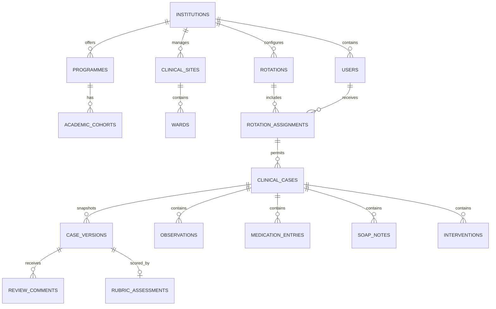

# Pharmalab Phase 1 Database Schema Direction

## 1. Modelling principles

- PostgreSQL is the source of truth.
- Institution ownership is explicit.
- Important clinical records use typed relational tables.
- JSONB is limited to versioned snapshots, bounded configuration and questionnaire responses.
- Submitted versions and audit events are immutable.
- Foreign keys, unique constraints and check constraints reinforce application validation.
- Externally exposed IDs use ULIDs or UUIDs.

## 2. Core relationship map

## 3. Identity and institution

### `institutions`

- `id`
- `name`
- `slug`
- `status`
- `timezone`
- timestamps

### `users`

- `id`
- `institution_id`
- `name`
- `email` or institutional login identifier
- `password`
- `status`
- `last_login_at`
- timestamps

Use a role/permission package or first-party role tables, but keep institution context in assignments. A user may gain more than one role only if policy explicitly supports it.

## 4. Academic structure

### `programmes`

- `id`, `institution_id`
- `name`, `code`
- `duration_years`
- `status`

### `academic_cohorts`

- `id`, `institution_id`, `programme_id`
- `name`
- `admission_year`
- `academic_year_label`
- `status`

### `clinical_sites`

- `id`, `institution_id`
- `name`, `code`, `status`

### `departments`

- `id`, `institution_id`, `clinical_site_id`
- `name`, `status`

### `wards`

- `id`, `institution_id`, `clinical_site_id`, nullable `department_id`
- `name`, `code`, `status`

Deactivate referenced records rather than deleting them.

## 5. Rotations and assignments

### `rotations`

- `id`, `institution_id`
- `programme_id`, nullable `academic_cohort_id`
- `clinical_site_id`, nullable `department_id`, nullable `ward_id`
- `name`
- `starts_on`, `ends_on`
- `status`: draft, scheduled, active, completed, archived
- `case_template_version_id`
- `rubric_version_id`
- `requirements_json`
- timestamps

### `rotation_assignments`

- `id`, `institution_id`, `rotation_id`
- `student_id`
- `primary_preceptor_id`
- `status`
- `starts_on`, `ends_on`
- timestamps

Recommended constraint: one active assignment for the same student and rotation. Overlapping rotations may be warned or blocked according to institutional policy.

## 6. Case ownership and workflow

### `clinical_cases`

- `id`, `institution_id`
- `rotation_assignment_id`, `student_id`
- `case_number` generated by the system
- `status`
- `current_revision_number`
- `lock_version` for optimistic concurrency
- `encounter_date`
- `case_category`
- `age_value` and `age_unit`, or an approved age-band representation
- nullable controlled `sex`
- `clinical_site_id`, nullable `department_id`, nullable `ward_id`
- `submitted_at`, `approved_at`
- timestamps and soft-delete/archive fields as approved

Do not create columns for patient name, full date of birth, phone, address, government ID or hospital MRN.

### `case_status_transitions`

- `id`, `institution_id`, `clinical_case_id`
- `from_status`, `to_status`
- `actor_id`
- nullable `case_version_id`
- nullable `reason`
- `created_at`

### `case_versions`

- `id`, `institution_id`, `clinical_case_id`
- `version_number`
- `source_revision_number`
- `snapshot_json`
- `snapshot_hash`
- `submitted_by`
- `submitted_at`
- nullable `approved_by`, `approved_at`

Unique constraint: `clinical_case_id + version_number`.

## 7. Clinical content

All clinical tables contain `institution_id`, `clinical_case_id`, author metadata and timestamps.

### `case_histories`

- Presenting complaints and duration
- History of present illness
- Past medical history
- Past medication history
- Family/social history
- Free narrative fields approved by faculty

Repeatable complaints may use a child `presenting_complaints` table.

### `allergies`

- Substance
- Reaction
- Severity/status
- Source
- Notes

### `observations`

- `type`: vital, laboratory or other investigation
- `code` or controlled local identifier where available
- `name`
- `value_numeric` or `value_text`
- `unit`
- `reference_low`, `reference_high`, `reference_text`
- `interpretation`
- `observed_at`
- `source`, `notes`

Enforce that a usable result value exists, but do not impose universal clinical reference ranges.

### `diagnoses`

- Name/code
- Primary/secondary rank
- Status
- Onset or encounter date
- Source and notes

### `medication_entries`

- Ingredient/generic name
- Optional brand name
- Dosage form and strength
- Dose value and unit
- Route
- Frequency/schedule
- Indication
- Start/stop date or ongoing flag
- Status: current, prior, held or discontinued
- Source and notes

### `soap_notes`

- Revision number
- Subjective
- Objective
- Assessment
- Plan
- Author and last-saved metadata

### `interventions`

- Problem category
- Evidence/rationale
- Suspected cause
- Proposed intervention
- Implementation status: proposed, communicated, completed
- Recipient
- Acceptance
- Outcome
- Monitoring/follow-up

### `adr_assessments`

- Suspected medicine
- Reaction and timeline
- Seriousness/action/outcome
- Assessment instrument/version
- Responses JSON
- Calculated score/category
- Student reasoning

## 8. Review and assessment

### `review_comments`

- `id`, `institution_id`
- `case_version_id`
- `clinical_case_id`
- `section_key`
- `author_id`
- `type`: required_correction, suggestion, positive_feedback
- `body`
- `status`: open, resolved, reopened
- nullable `resolved_by`, `resolved_at`
- timestamps

Comments are never hard deleted after submission. Corrections may append an edit history or retain a prior body.

### `rubrics` and `rubric_versions`

- Rubric identity and institution
- Version, effective dates and status
- Criteria/levels stored in relational children or bounded JSON configuration

### `rubric_assessments`

- `case_version_id`, `rubric_version_id`, `reviewer_id`
- Criterion results
- Total/result where applicable
- Overall feedback
- Decision
- completed timestamp

Historical assessments retain the rubric version used at the time.

## 9. Templates, notifications and audit

### `case_templates` and `case_template_versions`

- Template identity
- Version/effective date
- Required sections and bounded field configuration
- Status

### `notifications`

Use Laravel database notifications or a dedicated table. Notification payloads should contain IDs and safe summaries, not clinical narratives.

### `audit_events`

- `id`, `institution_id`
- `actor_id`, `actor_role`
- `event_type`
- `auditable_type`, `auditable_id`
- nullable `case_version_id`
- bounded metadata JSON
- nullable reason
- request/correlation metadata permitted by policy
- `created_at`

Audit events are append-only.

## 10. Offline synchronization

### `sync_operations`

- `id`
- `institution_id`, `user_id`, `clinical_case_id`
- `client_operation_id` unique per user/device operation
- `section_key`
- `base_lock_version`
- result status and server version
- timestamps

The business data remains in the relevant section tables. This record supplies idempotency and diagnostics without storing a second uncontrolled source of truth.

## 11. Index and constraint checklist

- Index every `institution_id` used in tenant queries.
- Compound indexes for case status + reviewer/assignment + updated date.
- Unique institution-scoped email/login where required.
- Unique case number within institution.
- Check encounter dates and rotation bounds according to confirmed policy.
- Check observation and medication numeric fields for valid formats, not diagnostic normality.
- Foreign keys use restrictive deletion for historical academic/clinical records.
- Snapshot and audit records cannot be updated through ordinary model operations.

## 12. Migration sequencing

1. Institution and identity
2. Academic/site setup
3. Rotations and assignments
4. Cases and transitions
5. Clinical section tables
6. Version snapshots
7. Review/rubric
8. Notifications and audit
9. Sync idempotency

Detailed clinical columns remain provisional until Phase 0 institutional validation is complete.
