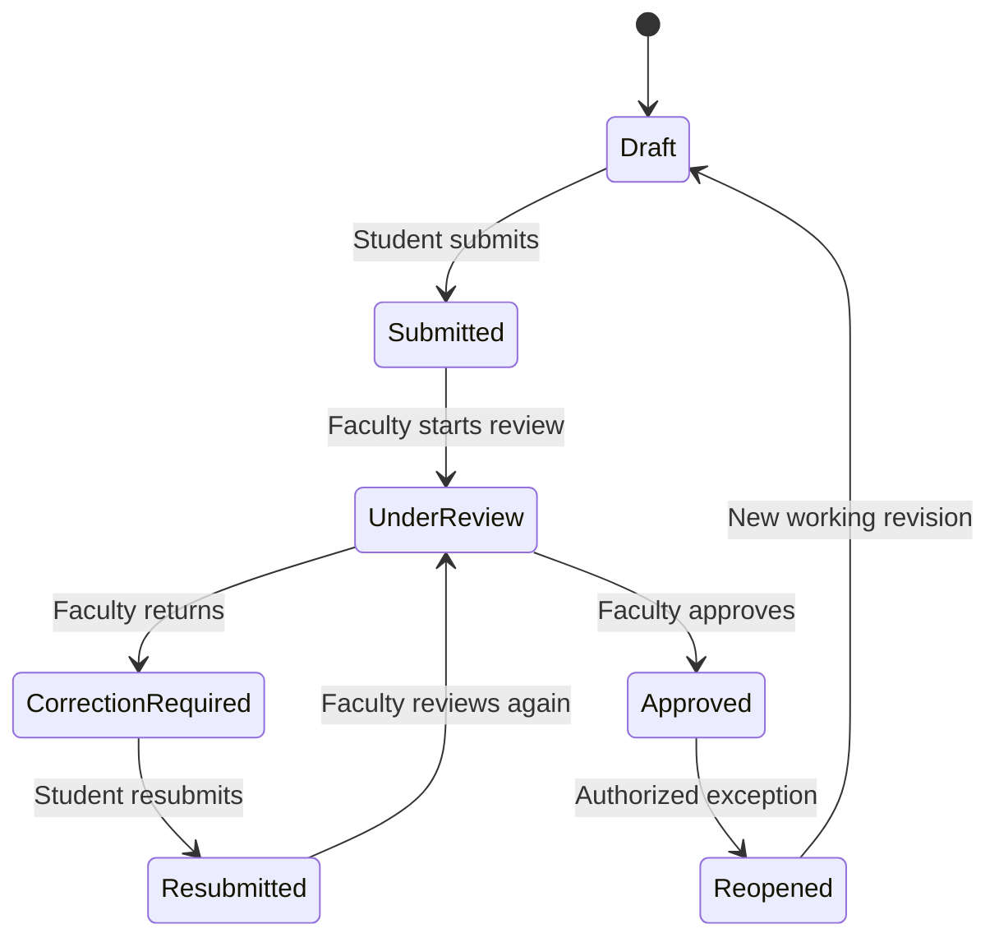
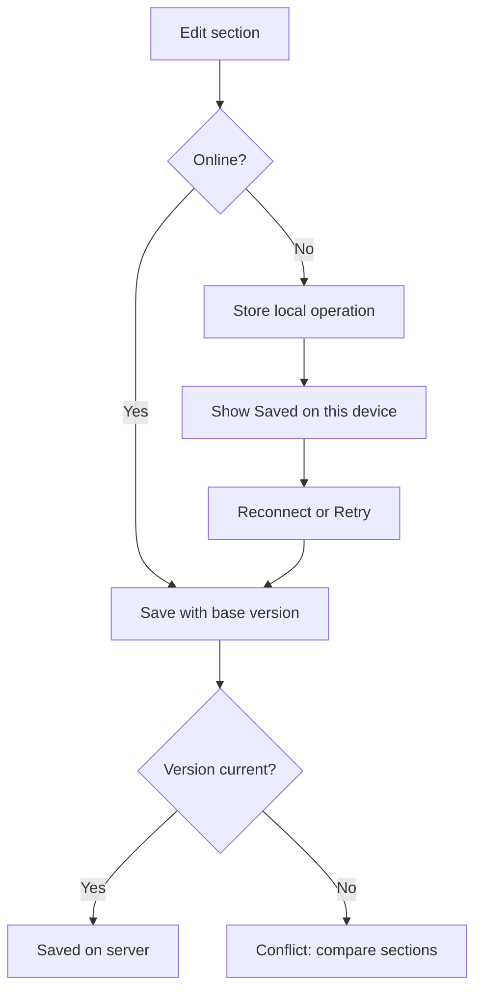

# Pharmalab Phase 1 Workflows

## 1. Workflow rules

- Status changes occur through named server-side transitions.
- Every transition checks actor, permission, assignment, current status and version.
- Submission and review decisions create audit records.
- Submitted versions are immutable.
- Student and faculty actions are clearly attributed.
- Notification failure does not roll back an otherwise valid committed transition; notifications are queued after commit.

## 2. Case lifecycle

### Status meanings

| Status | Meaning | Editable by student? |
|---|---|---:|
| Draft | Working case not submitted. | Yes |
| Submitted | Immutable version awaiting review. | No |
| Under review | Assigned faculty is reviewing the submitted version. | No |
| Correction required | Returned with required corrections; a new revision is available. | Flagged sections or all, per decision |
| Resubmitted | New immutable version awaiting review. | No |
| Approved | Explicit version approved and available in portfolio. | No |
| Reopened | Authorized exception recorded; new draft will be created. | After transition to Draft |

## 3. Rotation setup and assignment

### Preconditions

- Programme, cohort, clinical site and ward exist and are active.
- Student and preceptor accounts are active.
- Case template and rubric versions are selected where required.

### Flow

1. Admin creates rotation as Draft.
2. Admin selects dates, site/ward, programme/cohort and requirements.
3. System validates dates and references.
4. Admin assigns students and a primary preceptor.
5. System warns or blocks overlapping assignments according to policy.
6. Admin schedules/activates rotation.
7. Assigned users receive safe notifications.

Configuration changes after cases exist must be versioned or restricted so historical work remains interpretable.

## 4. Student creates a case

### Preconditions

- Student has an active assignment.
- Rotation permits new cases on the selected encounter date.

### Flow

1. Student selects `Create case`.
2. App displays the de-identification reminder.
3. Student selects encounter date, category and permitted demographics/context.
4. Server creates a case number and Draft.
5. Case opens on the completion task list.
6. `Case created` audit event is written.

Never use patient name or hospital MRN to identify the case.

## 5. Student documents the case

1. Student opens any permitted section from the task list.
2. Existing faculty feedback is shown when applicable.
3. Student enters structured or narrative data.
4. Client performs usability validation; server remains authoritative.
5. Online saves include current `lock_version`.
6. Server saves and increments the version or returns a conflict.
7. Task-list completeness is recalculated.

Autosave states: `Saving`, `Saved at …`, `Saved on this device`, `Sync failed` and `Conflict`.

## 6. Review before submission

1. Student opens Review case.
2. System runs completeness rules for the selected template version.
3. Blocking issues appear first and link to sections.
4. System runs de-identification pattern warnings.
5. Student reviews the read-only summary.
6. Student confirms attestation:
   - case is de-identified;
   - work is the student's own;
   - submission is for supervised educational review, not a clinical order.
7. Student selects `Submit for review` and confirms.

Submission requires online/current server state.

## 7. Submit case transition

### Preconditions

- Actor owns the case.
- Case is Draft or Correction required.
- Required sections pass completeness.
- No unresolved synchronization conflict exists.
- Submitted optimistic-lock version matches the server.

### Transaction

1. Revalidate completeness and permission.
2. Serialize and hash immutable case snapshot.
3. Create next case version.
4. Store attestation and submission time.
5. Transition to Submitted or Resubmitted.
6. Write transition and audit events.
7. Commit.
8. Queue notification to assigned preceptor.

Repeated requests with the same idempotency key must return the original result, not create duplicate versions.

## 8. Faculty review

1. Faculty opens Review queue.
2. System shows only authorized assigned cases.
3. Opening the case may transition Submitted/Resubmitted to Under review once.
4. Faculty reads the immutable version.
5. Faculty adds section comments:
   - Required correction
   - Suggestion
   - Positive feedback
6. Faculty completes the configured rubric.
7. Faculty selects Return for correction or Approve case.

Faculty cannot directly edit student clinical content.

## 9. Return for correction

### Preconditions

- Case is Under review.
- Reviewer is authorized.
- At least one open required correction or an overall return reason exists.

### Transaction

1. Save/validate review and rubric draft as permitted.
2. Record return reason and editable-section scope.
3. Create new working revision from reviewed snapshot.
4. Transition to Correction required.
5. Write audit/transition events.
6. Queue student notification.

Student sees required corrections before general content. Suggestions do not block resubmission unless faculty changes their type.

## 10. Correct and resubmit

1. Student opens returned case.
2. Required corrections appear as a checklist with section links.
3. Student edits only permitted sections unless `unlock all` was chosen.
4. Student may reply to/mark addressed feedback; faculty controls final resolution.
5. Review page displays a change summary.
6. Student confirms and resubmits.
7. New immutable version is created and case becomes Resubmitted.

## 11. Revision comparison

Faculty sees:

- Previous reviewed version and current version identifiers
- Changed sections first
- Before/after values with accessible labels
- Student change note where provided
- Required-comment state
- Unchanged sections collapsed by default

Phase 1 may use section-level comparison for complex repeatable records rather than unsafe automatic field merges.

## 12. Approval

### Preconditions

- Case is Under review.
- Reviewer is authorized.
- Mandatory rubric is complete.
- No unresolved required corrections remain.

### Transaction

1. Validate decision and rubric.
2. Mark explicit case version approved.
3. Transition case to Approved.
4. Record reviewer, timestamp and audit event.
5. Queue student notification.

Approval makes the version visible in the student's portfolio. It does not convert the work into a clinical order.

## 13. Reopen approved case

Reopening is exceptional.

- Requires a dedicated permission.
- Requires a reason.
- Preserves the approved version and decision.
- Creates an audit event and new working revision.
- Notifies relevant users.

## 14. Offline save and conflict

Conflict options:

- Use server section
- Keep device draft as a copy
- Replace a whole section after explicit review

Do not silently use last-write-wins for clinical sections.

## 15. Exceptional states

- Rotation completed while case remains Draft: apply confirmed grace/locking policy.
- Reviewer reassigned: preserve previous comments and update queue authorization.
- User deactivated: preserve authored records; prevent new actions.
- Template/rubric updated: existing case retains the version selected at creation/submission.
- Notification failed: show in operational monitoring and retry; do not duplicate transition.
