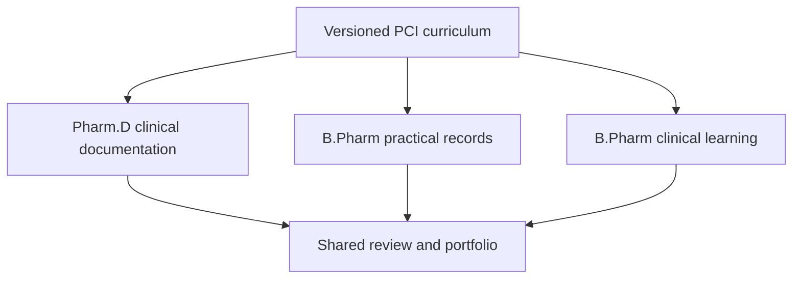

# PCI Curriculum and Phase 1 Direction

**Date:** 2026-09-22

**Status:** Accepted product direction; implementation details remain subject to the gates below

**Owner:** Product owner

## 1. Purpose

This note records the decisions reached after reviewing the product direction, the student-facing NEXPHARMED reference workflow, the PCI B.Pharm syllabus aligned to NEP 2020, and the PCI Pharm.D Regulations 2008.

It is the durable record of the current discussion. `PROJECT_STATE.md` remains the concise source of truth for the active gate and exact next action.

## 2. Authoritative curriculum sources

| Programme              | Authoritative baseline                                                                                                  | Product consequence                                                                                                                              |
| ---------------------- | ----------------------------------------------------------------------------------------------------------------------- | ------------------------------------------------------------------------------------------------------------------------------------------------ |
| B.Pharm                | Pharmacy Council of India, _Bachelor of Pharmacy Syllabus (2026), as per NEP 2020_, proposed from academic year 2026–27 | Drives programme structure, practical subjects, internships, field visits and research-project requirements.                                     |
| Pharm.D                | Pharmacy Council of India, _Pharm.D Regulations 2008_                                                                   | Drives hospital postings, clinical case work, ward-round documentation, clinical pharmacy activities, projects and internship/residency records. |
| University affiliation | ANU affiliation                                                                                                         | ANU is affiliation/academic administration context for the institution; it is not the syllabus authority for these Phase 1 templates.            |

The supplied source PDFs are research inputs and are not committed to the repository. Any later amendment, circular or replacement from PCI must be reviewed before changing a published curriculum version.

## 3. Accepted Phase 1 scope

Phase 1 supports:

- B.Pharm students under the applicable PCI curriculum version.
- Pharm.D students under the PCI Pharm.D Regulations 2008.
- Pharm.D clinical cases and related clinical-pharmacy records.
- B.Pharm clinical learning/case exercises and practical records.
- All B.Pharm practical subjects, configured in staged semester groups rather than implemented as unrelated hard-coded forms.
- A shared submission, faculty review, correction, approval and portfolio workflow.

M.Pharm is outside the currently accepted Phase 1 programme scope. It may be added later through a separately approved curriculum package.

## 4. Product model

The two programmes must not be forced into one identical record form.

### 4.1 Pharm.D clinical documentation

The Pharm.D workflow is a longitudinal, ward-oriented learning record. Its planned sections include:

- de-identified patient profile;
- presenting complaints and histories;
- examination findings and vital signs;
- diagnoses and laboratory investigations;
- medication chart and medication history;
- SOAP assessment;
- drug-related problems and pharmacist interventions;
- monitoring and patient counselling;
- ADR, interaction and drug-information records when applicable;
- case presentation, posting log and preceptor certification.

The complete field list, validation rules, rubric and reviewer authority still require faculty/institutional approval. PCI defines the baseline; local rules may add governed requirements but must not silently replace the PCI curriculum baseline.

### 4.2 B.Pharm practical records

B.Pharm requires a configurable practical-record engine. A common template may contain:

- experiment number and date;
- title and aim;
- requirements;
- principle or theory;
- procedure;
- observations;
- calculations;
- results;
- precautions;
- viva/questions;
- attachments;
- faculty remarks, marks and approval.

Individual subject templates may enable, disable, rename, reorder or repeat suitable sections. Experiment lists, minimum record counts and assessment rules belong to a versioned curriculum/template configuration, not application source code.

### 4.3 B.Pharm clinical learning

The PCI syllabus supports medication-chart review, pharmacist interventions, patient counselling, drug-information work and disease case studies. Phase 1 should therefore support masked/theoretical cases and clinical simulations, together with approved internship or field-work records.

Using real ward-patient cases for B.Pharm is not assumed merely because Pharm.D supports them. That is an institutional privacy and placement decision.

## 5. Curriculum and template versioning rules

- Every programme is linked to an explicit curriculum version.
- Every practical/clinical template has a draft and published version.
- Published versions used by students are immutable.
- A student record retains the exact template version on which it was created.
- A new template publication does not rewrite historical or already-submitted records.
- Curriculum assignment must account for admission batch and academic period.
- Mid-period template-change behaviour must be explicitly approved before implementation.
- Institutions may configure local additions within governed boundaries without modifying the authoritative PCI package silently.

## 6. Gate plan

| Order | Gate                         | Primary outcome                                                                                                   |
| ----: | ---------------------------- | ----------------------------------------------------------------------------------------------------------------- |
|     1 | `PCI-TEMPLATE-FOUNDATION-01` | Approved architecture and UX specification for curriculum, template publishing, version retention and assignment. |
|     2 | `PHARMD-CASE-01`             | Complete de-identified Pharm.D case workspace using the accepted sync approach.                                   |
|     3 | `PHARMD-CLINICAL-RECORDS-01` | ADR, intervention, counselling, interaction, drug-information, medication-history and posting records.            |
|     4 | `REVIEW-WORKFLOW-01`         | Section comments, corrections, resubmission comparison, rubric, approval and governed reopening.                  |
|     5 | `BPHARM-RECORD-ENGINE-01`    | Reusable practical-record renderer and faculty-review workflow.                                                   |
|     6 | `BPHARM-PCI-TEMPLATES-01`    | PCI practical subjects configured in semester groups, including internships, visits and projects.                 |
|     7 | `PORTFOLIO-REPORTING-01`     | Authorized progress, completion, portfolio and export views.                                                      |
|     8 | `PWA-RESILIENCE-01`          | Controlled caching, recovery and supported-device verification.                                                   |
|     9 | `PILOT-HARDENING-01`         | Accessibility, security, performance, backup/restore and pilot usability gates.                                   |

## 7. Internet and competitor inspiration protocol

Each gate receives a small research pass before UX approval and implementation.

| Area                           | Candidate references                                                     | Pattern to study                                                           |
| ------------------------------ | ------------------------------------------------------------------------ | -------------------------------------------------------------------------- |
| Curriculum/template foundation | Moodle, Canvas, Form.io and OpenMRS forms                                | Conditional fields, publishing, versioning and assignment.                 |
| Pharmacy experiential workflow | Clinirex, NEXPHARMED, CORE ELMS, RxPreceptor and MedHub                  | Case entry, rotation logs, requirements and preceptor certification.       |
| Faculty review                 | Canvas SpeedGrader, Turnitin and Google Classroom                        | Queues, comments, rubrics, correction and resubmission.                    |
| Practical records              | LabArchives, SciNote, Benchling and educational electronic lab notebooks | Experiment structure, repeatable observations, attachments and signatures. |
| Portfolio                      | PebblePad, Mahara and experiential-education products                    | Progress, evidence, competency and export presentation.                    |
| Mobile interaction             | Relevant Mobbin healthcare, education and field-work patterns            | Navigation, long forms, autosave, progress and connectivity states.        |

References are candidates for focused review, not endorsements and not evidence that their complete workflows are suitable.

For each gate, record:

1. PCI and institutional requirements.
2. Three to five relevant reference products.
3. Screen and component inventory.
4. Workflow and important states.
5. Patterns selected and rejected, with reasons.
6. Mobile/tablet wireframes.
7. Privacy, accessibility and offline considerations.
8. Acceptance criteria and unresolved institutional questions.

Do not copy proprietary clinical content, drug databases, exact interfaces, branding or protected forms. Product patterns remain subordinate to PCI requirements, privacy policy and faculty validation.

## 8. Immediate milestone boundary

### `PCI-TEMPLATE-FOUNDATION-01`

**Current status:** Research and specification.

**Questions to resolve:**

- How an administrator creates, previews and publishes a template.
- How sections, fields, repeatable groups, conditional rules and required fields are represented.
- How a curriculum version assigns templates to programme, year/semester, subject and activity.
- How published versions remain attached to student records.
- How a template is copied safely between subjects or curriculum versions.
- How assessment and faculty-review configuration is linked without prematurely fixing an institutional rubric.
- How mobile preview, autosave capability and later offline synchronization are represented.
- How import/export or bulk configuration could be added later without blocking Phase 1.

**Out of scope for this gate:**

- entering all B.Pharm experiment content;
- the full Pharm.D clinical form implementation;
- final institutional rubrics;
- drug monographs or interaction databases;
- AI recommendations;
- a public API or native application.

**Exit condition:** A reviewed specification and wireframes define the minimum versioned curriculum/template capability needed by both `PHARMD-CASE-01` and `BPHARM-RECORD-ENGINE-01`. Implementation begins only after that bounded specification is accepted.

## 9. Decisions still requiring institutional validation

- Exact Pharm.D case fields and which sections are required by rotation.
- Whether the institution uses an additional approved bedside case-history form.
- Permitted patient demographics and identifiers beyond the current de-identification baseline.
- Reviewer, co-reviewer, return, approval and exceptional-reopen authority.
- Rubric, scoring, pass and signature requirements.
- When ADR/Naranjo is required.
- B.Pharm use of real ward cases, if any.
- Practical-record experiment lists where PCI permits institutional selection.
- Case/record quotas, completion rules and grace periods.
- Mandatory reports, retention periods and supported devices.

These questions do not prevent the bounded template-foundation research/specification gate. They do prevent final publication of affected clinical/practical templates.
