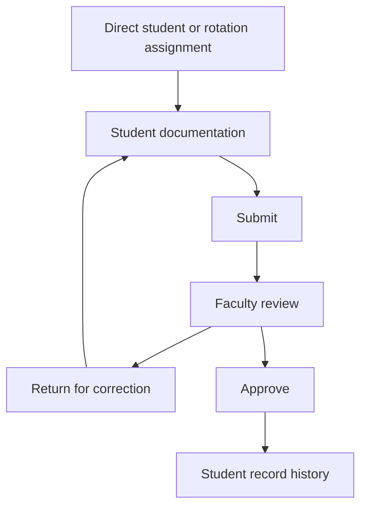
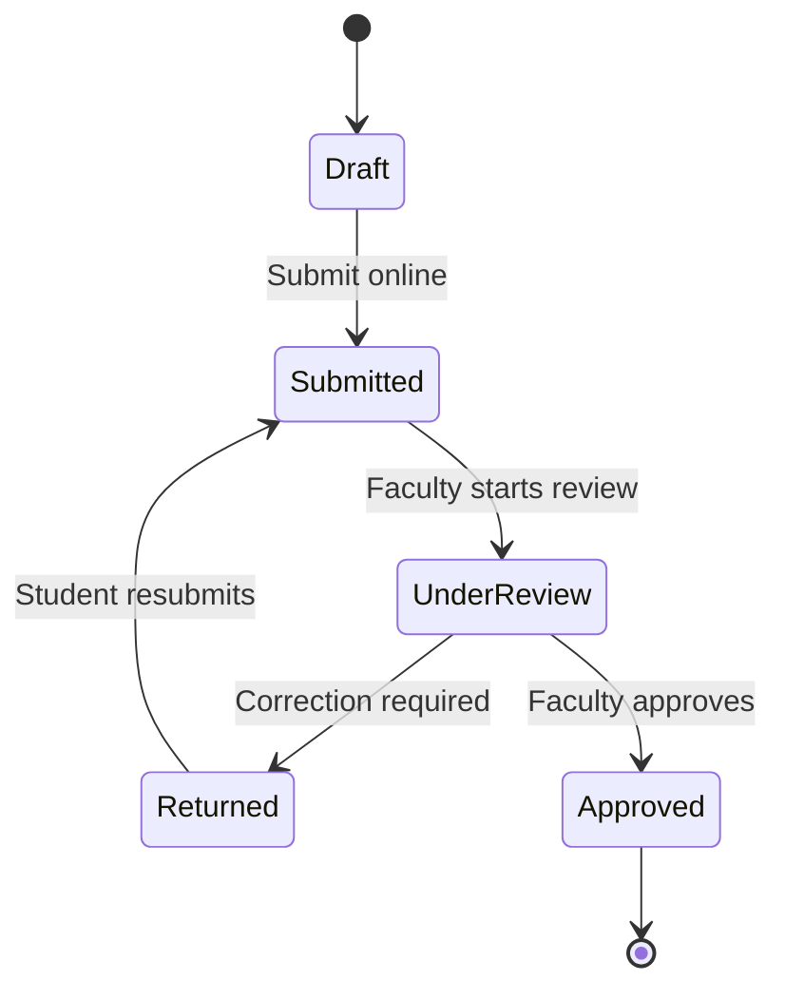

# Direct Documentation Workflow Specification

**Document ID:** `DIRECT-DOCUMENTATION-SCOPE-01`  
**Status:** Accepted direction for Phase 1 implementation planning  
**Date:** 24 September 2026  
**Product:** Pharmalab Phase 1  
**Technical baseline:** Laravel 13, Inertia 3, Vue 3, TypeScript and PostgreSQL

## 1. Decision and purpose

Pharmalab Phase 1 will extend the accepted walking skeleton into a direct clinical and practical documentation workflow. It will not implement or store a PCI curriculum model.

The Phase 1 learning loop is:

This specification authorizes planning for that bounded workflow. It does not authorize a curriculum engine, complete B.Pharm subject catalogue, drug database, interaction checker, clinical calculator or AI review.

## 2. Explicitly excluded data model

Phase 1 will not introduce:

- `curriculum_versions`;
- `curriculum_source_references`;
- `curriculum_periods`;
- `subjects` or subject-period junctions;
- curriculum activity requirements;
- student curriculum-period enrolments;
- automatic curriculum-to-template assignment;
- a PCI clause-to-database mapping;
- a general-purpose dynamic template marketplace or cross-institution template exchange.

No year, semester, subject or regulatory curriculum relationship is required to create, submit, review or approve a Phase 1 record.

The already accepted programme, cohort, clinical-site, ward, rotation and rotation-assignment records remain untouched. This gate does not add curriculum behaviour to them and does not authorize destructive removal of accepted runtime tables.

## 3. Existing runtime baseline

The current application already provides:

- authentication and student, faculty and administrator roles;
- institution-scoped authorization;
- programme, cohort, clinical-site, ward and rotation administration;
- student/preceptor rotation assignments;
- minimal de-identified clinical cases and SOAP notes;
- draft, submitted, under-review, returned and approved states;
- immutable submission snapshots and status history;
- student portfolio visibility for approved cases;
- IndexedDB draft recovery, idempotent sync, optimistic locking and explicit conflict resolution;
- audit events and automated authorization/workflow tests.

The next implementation gate must extend this baseline rather than replace it with a second record or assignment engine.

## 4. Phase 1 scope

### 4.1 Student documentation

The student can:

- view records or activities available through an explicit authorized assignment;
- start a de-identified clinical case or approved practical record;
- complete the approved fixed sections;
- save and recover permitted drafts during intermittent connectivity;
- review validation issues before submission;
- submit online;
- read faculty feedback;
- edit a returned record and resubmit it;
- view approved records in their history/portfolio.

### 4.2 Faculty review

The assigned faculty member can:

- view submitted records inside their authorized scope;
- open the exact submitted snapshot;
- start review;
- enter a review summary and approved feedback fields;
- return the record with an actionable reason;
- approve the record;
- view prior submissions and status transitions.

Detailed inline comments, rubrics, marks and exceptional reopening remain separate decisions. They are not implied by the basic return/approve workflow.

### 4.3 Administration

The administrator continues to manage users, institutions, clinical locations and rotation assignments already present in the application. Phase 1 does not add curriculum, subject, semester or regulatory mapping administration.

## 5. Record and form approach

Phase 1 begins with fixed, faculty-approved record structures. The application may use bounded code/configuration definitions and a stable `form_version` identifier so historical records remain interpretable.

Rules:

1. A record stores its record type and form version when it is created.
2. Later form changes do not rewrite existing drafts, submissions or approvals.
3. Submitted and approved snapshots remain immutable.
4. The server validates every field; client validation is a usability aid.
5. Unknown fields are rejected.
6. Direct patient identifiers are not part of standard forms.
7. A dynamic template builder, template publishing lifecycle and curriculum-based template resolution are deferred.

Candidate Phase 1 record types are:

- Pharm.D clinical case with SOAP documentation;
- B.Pharm practical record using a faculty-approved fixed structure;
- other direct clinical-learning records only after their fields are separately approved.

The exact sections and mandatory fields remain blocked by faculty validation. The existing minimal case/SOAP form remains the safe fallback until that validation is complete.

## 6. Authorization rules

- Students may read and edit only their own eligible drafts.
- Students may not edit submitted, under-review or approved snapshots.
- Students may edit a returned record only through the controlled correction path.
- Faculty may review only records covered by their accepted assignment relationship.
- Administrators may manage configuration but do not silently alter student clinical content.
- Every read and write remains institution-scoped.
- Role checks in the interface are not a substitute for Laravel policies and scoped validation.

## 7. Record lifecycle

Required transition behaviour:

| Transition | Minimum requirement |
| --- | --- |
| Draft to Submitted | Server validation passes, de-identification attestation is confirmed and an immutable snapshot is created. |
| Submitted to Under Review | Reviewer is authorized and the selected snapshot is recorded. |
| Under Review to Returned | A bounded correction reason is required and audited. |
| Returned to Submitted | A new immutable submission snapshot is created; previous snapshots remain available. |
| Under Review to Approved | Reviewer decision and time are recorded against the exact snapshot. |

Approved-record reopening is not part of the normal Phase 1 workflow and requires a separately approved exceptional policy.

## 8. Screens and routes

Routes are proposed Inertia web routes; final names may follow existing route conventions.

### Student

| Screen | Purpose |
| --- | --- |
| My records/cases | Shows draft, returned, submitted and approved records available to the student. |
| Create/start record | Starts one approved fixed record type within an authorized assignment. |
| Record editor | Mobile-first sections, validation, save/sync state and conflict handling. |
| Submission review | Read-only confirmation, de-identification attestation and online submission. |
| Feedback/corrections | Shows faculty reason and the permitted correction path. |
| Record history/portfolio | Shows approved records and prior submission versions. |

### Faculty

| Screen | Purpose |
| --- | --- |
| Review queue | Lists submitted records inside faculty assignment scope. |
| Review workspace | Shows the immutable submitted snapshot and approved review controls. |
| Return confirmation | Requires a clear correction reason. |
| Approval confirmation | Confirms the exact snapshot being approved. |

Every screen must define loading, empty, validation, network failure, unauthorized and conflict states.

## 9. Mobile and connectivity requirements

- Student editing is phone-first and tablet-friendly.
- Labels remain visible; placeholder-only fields are prohibited.
- Long records use sections and progress, not one continuous form.
- Save, pending, offline, retry and conflict states remain visible.
- Draft recovery reuses the accepted `SYNC-SPIKE-01` protocol.
- Submission, return and approval require an authoritative online state.
- Cold offline application launch is not promised in this gate.
- Local permitted drafts clear on logout under the accepted baseline.

## 10. Privacy and audit

- Standard forms omit patient name, full date of birth, phone, address, government ID and hospital record number.
- The system uses a generated educational case/record identifier.
- Free-text areas display de-identification guidance.
- Audit events store IDs and bounded metadata, not full clinical narratives.
- Submission, return, resubmission and approval are auditable.
- Attachment upload is excluded until privacy, malware scanning, storage and retention rules are approved.

## 11. Acceptance criteria for the next implementation gate

- [ ] No new curriculum, subject, semester, regulatory-source or curriculum-assignment table is introduced.
- [ ] Existing accepted runtime tables remain compatible.
- [ ] A student can start one approved fixed record type through an authorized direct/rotation relationship.
- [ ] The student can save, submit, receive a return reason, correct and resubmit.
- [ ] Assigned faculty can review, return and approve the exact submitted snapshot.
- [ ] Approved history remains visible without rewriting previous versions.
- [ ] Cross-user, cross-role and cross-institution access is rejected by automated tests.
- [ ] Mobile layouts cover all required states.
- [ ] The accepted sync/conflict behaviour is reused for permitted drafts.
- [ ] Direct patient identifier fields are absent from standard forms.
- [ ] CI, PHPStan, Pint, frontend lint/formatting, TypeScript and production build pass.
- [ ] Browser verification covers the complete return/resubmission/approval loop.

## 12. Decisions still required

| Decision | Owner | Blocks |
| --- | --- | --- |
| Exact Pharm.D clinical case sections and mandatory fields | Pharm.D faculty lead | Complete case form |
| First B.Pharm practical record structure and fields | B.Pharm faculty lead | B.Pharm record implementation |
| Whether students self-start records or faculty creates every assignment | Product owner + faculty | Start-record workflow |
| Detailed comment model: summary only, section comments or field comments | Faculty lead | Review workspace |
| Whether Phase 1 includes marks/rubrics | Faculty assessment owner | Assessment implementation |
| Approved-record reopening authority and reason codes | Product owner + faculty | Exceptional reopen path |
| Retention and exceptional deletion policy | Privacy/legal owner + IT | Production policy |
| Supported pilot devices and browsers | Institution IT + pilot users | Pilot certification |
| Attachment policy | Privacy owner + IT + faculty | Any file upload |

## 13. Next gate

`DIRECT-DOCUMENTATION-IMPL-01` will implement only the bounded direct workflow above. It will begin with one faculty-approved fixed record structure and extend the accepted walking skeleton without adding a curriculum engine or dynamic template builder.

Later gates may add detailed comments, rubrics, additional approved record types, reports, stronger PWA resilience, drug references or AI only after separate product approval.
