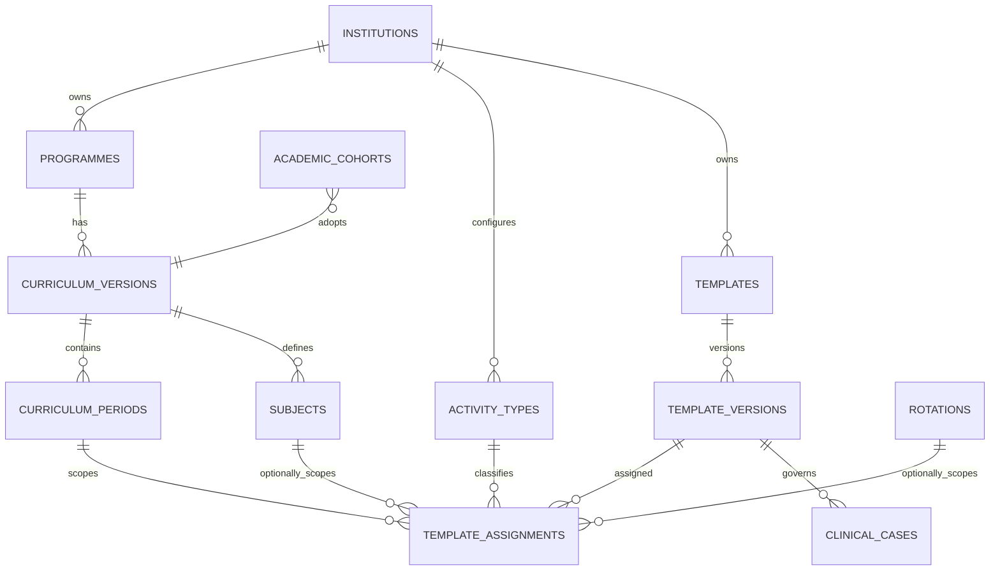
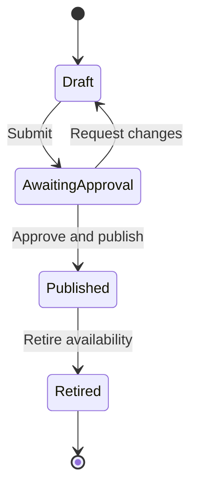
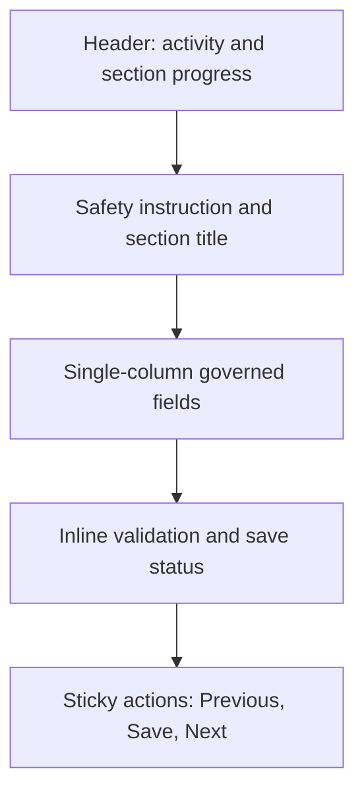
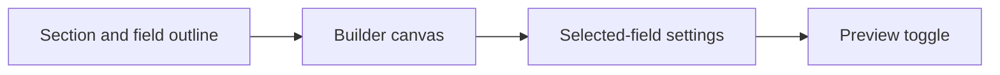
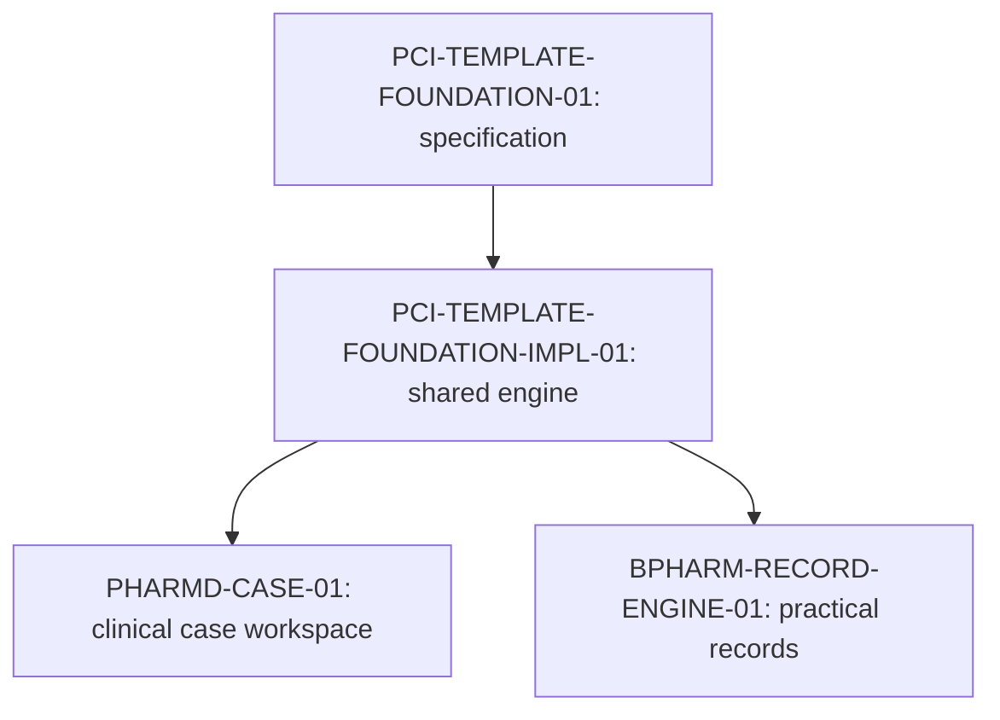

# PCI Template Foundation Specification (Gate 01)

**Document ID:** `PCI-TEMPLATE-FOUNDATION-01`  
**Status:** Draft for product-owner and faculty review  
**Date:** 22 September 2026  
**Product:** Pharmalab Phase 1  
**Technical baseline:** Laravel 13, Inertia 3, Vue 3, TypeScript and PostgreSQL

## 1. Purpose and gate boundary

This document defines the minimum versioned curriculum and template capability shared by Pharm.D clinical documentation, B.Pharm practical records and B.Pharm clinical-learning records.

This is a specification gate. It contains architecture, workflow, screen, privacy, accessibility and test requirements only. It does not authorize application code, migrations, final clinical fields, final rubrics or entry of the complete PCI practical curriculum.

Gate 01 may close only after the specification and wireframes are reviewed, the remaining decisions are explicitly owned, and the product owner accepts the future gate sequence.

## 2. Regulatory requirements and traceability

### 2.1 Authorities

| Programme | Accepted authority | Product consequence |
| --- | --- | --- |
| B.Pharm | PCI Bachelor of Pharmacy Syllabus 2026 aligned to NEP 2020, proposed from academic year 2026–27 | Curriculum versions must represent the applicable semesters, practical subjects, internships, visits and projects. |
| Pharm.D | PCI Pharm.D Regulations 2008 | Curriculum versions must represent hospital postings, clinical case work, clinical-pharmacy activities, projects and internship/residency records. |
| Institutional affiliation | ANU affiliation | ANU supplies institutional and academic-administration context; it does not replace the accepted PCI curriculum baseline. |

The official source PDFs are research inputs and are not committed to the repository. Before Gate 01 is accepted, every regulatory row below must contain a verified document title plus page, section or schedule locator. A summary without a source locator is not sufficient traceability.

### 2.2 Preliminary traceability register

| Trace ID | Regulatory requirement or accepted interpretation | System requirement | Verification method | Official source locator |
| --- | --- | --- | --- | --- |
| `PCI-BP-001` | B.Pharm practical work must be represented across the applicable PCI curriculum periods. | Versioned B.Pharm curriculum periods, subjects, activity types and practical-record template assignments. | Trace every configured practical subject to the approved PCI source and an effective published template assignment. | Pending page-level source extraction. |
| `PCI-BP-002` | B.Pharm clinical learning may include medication-chart review, pharmacist intervention, counselling, drug-information work and case-based learning. | Distinct B.Pharm clinical-learning templates; real-patient use is not assumed. | Faculty validates representative masked/simulated records before publication. | Pending page-level source extraction. |
| `PCI-PD-001` | Pharm.D includes hospital postings, ward-oriented case documentation and supervised clinical-pharmacy activities. | Pharm.D templates support longitudinal case and posting records while retaining the exact template version used. | Create, submit, review and reopen representative de-identified records without changing historical versions. | Pending page-level source extraction. |
| `PCI-PD-002` | Pharm.D projects and internship/residency activities require governed documentation and supervision. | Activity-level assignment supports case, posting, project and internship/residency record types. | Resolve the correct published version for each configured activity context. | Pending page-level source extraction. |
| `INST-PRIV-001` | Standard educational forms must not request direct patient identifiers. | No structured field for patient name, full date of birth, phone, address, government ID or hospital MRN/IP number. | Schema validation and negative tests reject prohibited structured field definitions. | Institutional privacy approval pending. |

PCI requirements, product interpretations and local institutional additions must remain distinguishable. An institution may add governed requirements, but it must not silently edit the authoritative PCI package or rewrite a published version.

## 3. Existing architecture reconciliation

### 3.1 Implemented runtime baseline

The current application implements these relevant tables:

- `institutions`;
- `users`;
- `programmes`;
- `academic_cohorts`;
- `clinical_sites`, `departments` and `wards`;
- `rotations` and `rotation_assignments`;
- `clinical_cases`, `soap_notes`, `case_versions` and `case_status_transitions`;
- `case_draft_notes`, `sync_operations` and `audit_events`.

The current application does **not** implement `case_templates`, `case_template_versions`, `curriculum_versions`, `curriculum_periods`, `subjects`, `activity_types` or `template_assignments`. References to case-template tables in `docs/DATABASE_SCHEMA.md` are planned architecture, not deployed schema.

The existing runtime uses:

- ULIDs for institution-owned domain records;
- integer foreign keys for `users.id` references;
- explicit `institution_id` ownership;
- restrictive foreign-key deletion;
- Laravel policies, institution global scopes and institution-scoped validation;
- immutable submission snapshots in `case_versions`;
- `lock_version`, idempotent operation IDs and IndexedDB for the accepted sync protocol.

### 3.2 Extension strategy

1. Preserve `programmes`, `academic_cohorts`, rotations and the accepted walking-skeleton case workflow.
2. Introduce the shared curriculum and template tables only in the future implementation gate.
3. Add a curriculum-version reference to an academic cohort rather than treating a cohort as a curriculum period.
4. Attach an exact `template_version_id` to each future domain record. Existing `clinical_cases` will receive this relationship through a reviewed migration; later B.Pharm record entities will use the same rule.
5. Do not create a generic `student_records` table in Gate 01. Pharm.D cases and B.Pharm practical records may retain distinct domain tables while sharing template, review and portfolio infrastructure.
6. Do not rename or migrate nonexistent runtime tables. If another branch introduces overlapping template tables before implementation begins, stop and reconcile the schema first.

### 3.3 Institution-scoping enforcement

Every new institution-owned table carries `institution_id`. Tenant isolation requires all applicable layers:

- restrictive foreign keys and compound uniqueness where practical;
- application checks preventing cross-institution relationships;
- the existing `BelongsToInstitution` global scope;
- Laravel policies for every read and state transition;
- institution-scoped `exists` validation for submitted foreign keys;
- negative tests for cross-institution reads, writes, assignments, copies and publication.

A service layer alone is not an authorization boundary. Foreign-key ownership must be reconciled transactionally before any write.

## 4. Proposed data model

### 4.1 Relationship overview

### 4.2 Curriculum entities

#### `curriculum_versions`

| Column | Proposed type | Rule |
| --- | --- | --- |
| `id` | ULID | Primary key. |
| `institution_id` | ULID FK | Required tenant owner. |
| `programme_id` | ULID FK | Must belong to the same institution. |
| `name` | string | Human-readable version name. |
| `regulatory_source` | text | Official title and version; detailed traceability remains in the register. |
| `effective_from`, `effective_to` | date, nullable date | Effective window for cohort adoption. |
| `status` | string | Proposed values: draft, active, superseded, archived. |
| `created_by`, `updated_by` | user FK | Integer IDs matching the existing users table. |
| timestamps | timestamps | Normal administrative metadata. |

Suggested uniqueness: `institution_id + programme_id + name`.

#### `curriculum_periods`

Curriculum periods represent progression inside a curriculum version. They do not represent admission cohorts.

| Column | Proposed type | Rule |
| --- | --- | --- |
| `id` | ULID | Primary key. |
| `institution_id` | ULID FK | Required tenant owner. |
| `curriculum_version_id` | ULID FK | Same institution. |
| `code`, `name` | string | Examples: `SEM-03`, `YEAR-04`, `INTERNSHIP`. |
| `period_kind` | string | Bounded values such as semester, programme_year or internship. |
| `sequence` | unsigned integer | Unique within one curriculum version. |
| `status` | string | Active/inactive administrative state. |

Calendar sessions and admission cohorts remain separate. `academic_cohorts.curriculum_version_id` records adoption of a curriculum version.

#### `subjects`

| Column | Proposed type | Rule |
| --- | --- | --- |
| `id` | ULID | Primary key. |
| `institution_id` | ULID FK | Required tenant owner. |
| `curriculum_version_id` | ULID FK | The programme is derived through the curriculum version. |
| `code`, `title` | string | Unique code within a curriculum version. |
| `status` | string | Active/inactive. |

Period membership may use a constrained `curriculum_period_subjects` join when one subject legitimately appears in more than one period. It must not be inferred from a free-text programme context.

#### `activity_types`

| Column | Proposed type | Rule |
| --- | --- | --- |
| `id` | ULID | Primary key. |
| `institution_id` | ULID FK | Required tenant owner. |
| `code`, `name`, `description` | string/text | Stable code; labels may change while referenced records remain valid. |
| `status` | string | Active/inactive. |

Examples include clinical case, practical experiment, posting log, project report and internship/residency record. The final catalogue is configured and versioned from approved curriculum requirements.

### 4.3 Template identity and versions

#### `templates`

`templates` is a mutable identity and grouping record.

| Column | Proposed type | Rule |
| --- | --- | --- |
| `id` | ULID | Primary key. |
| `institution_id` | ULID FK | Required tenant owner. |
| `name`, `description` | string/text | Administrative identity. |
| `created_by`, `updated_by` | user FK | Same-institution actors. |
| `status` | string | Active/archived identity state. |
| timestamps | timestamps | Administrative metadata. |

#### `template_versions`

| Column | Proposed type | Rule |
| --- | --- | --- |
| `id` | ULID | Primary key. |
| `institution_id` | ULID FK | Must match the parent template. |
| `template_id` | ULID FK | Parent identity. |
| `version_number` | unsigned integer | Unique and increasing within the template. |
| `schema_version` | unsigned integer | Identifies the renderer/schema contract. |
| `schema_json` | JSONB | Bounded fields, structural components, validation and conditional rules. |
| `schema_hash` | 64-character string | Canonical SHA-256 generated on publication. |
| `status` | string | Proposed: draft, awaiting_approval, published, retired. |
| `created_by`, `submitted_by`, `approved_by`, `published_by`, `retired_by` | nullable user FKs | Set only for applicable transitions. |
| transition timestamps | nullable timestamps | Submitted, approved, published and retired timestamps. |
| `copied_from_template_version_id` | nullable ULID FK | Source version when duplicated. |
| `copied_by`, `copied_at` | nullable user FK/timestamp | Copy provenance. |
| timestamps | timestamps | Draft metadata; published content may not be ordinarily updated. |

After publication, `schema_json`, `schema_version`, `schema_hash`, `version_number`, `template_id` and provenance are immutable. Retirement is an audited availability transition; it may update only retirement metadata and status. Changes to content require a new draft version.

The canonical JSON serialization and hash procedure must be specified before implementation so equivalent schemas produce the same hash.

### 4.4 Template assignments and deterministic resolution

#### `template_assignments`

| Column | Proposed type | Rule |
| --- | --- | --- |
| `id` | ULID | Primary key. |
| `institution_id` | ULID FK | Must match every referenced entity. |
| `template_version_id` | ULID FK | Must reference a published, non-retired version when activated. |
| `curriculum_version_id` | ULID FK | Required. |
| `curriculum_period_id` | ULID FK | Required. |
| `activity_type_id` | ULID FK | Required. |
| `subject_id` | nullable ULID FK | Required for subject-scoped activities. |
| `rotation_id` | nullable ULID FK | Used only for an explicitly rotation-specific override. |
| `scope_kind` | string | Proposed: subject, rotation or period. Controls which nullable key is legal. |
| `effective_from`, `effective_to` | date, nullable date | Assignment window. |
| `created_by`, `retired_by` | user FK, nullable user FK | Actor metadata. |
| `retired_at` | nullable timestamp | Prevents use for new records while preserving history. |

Check constraints and application validation must enforce the valid key combination for each `scope_kind`.

#### Resolution inputs

Resolution uses:

`Institution + Cohort curriculum version + current curriculum period + activity type + subject or rotation context + effective date`

#### Resolution algorithm

1. Derive the curriculum version from the student's active cohort; do not accept it from client input.
2. Validate that the period, subject/rotation and activity belong to the same institution and permitted curriculum context.
3. Find active assignments effective on the record start date.
4. Use an exact rotation assignment when the activity is explicitly rotation-scoped; otherwise use the exact subject or period scope defined for that activity.
5. Reject multiple matches at the same valid scope as a configuration error. Do not use an `is_primary` flag to hide an overlap.
6. Return one exact published, non-retired `template_version_id` and persist it on the new domain record.
7. Never replace the persisted version because a newer template is later published.

Overlapping assignments at the same scope are invalid. The implementation gate must use transactional validation and locking, plus a database exclusion or equivalent constraint where PostgreSQL can express the effective-date rule safely.

If a required activity has no resolvable assignment, the student sees a safe unavailable state and the administrator receives a configuration alert. The system must not silently interpret missing configuration as “no documentation required.”

### 4.5 Copy provenance

Copying creates a new draft version; it never edits the source.

Required provenance:

- source `template_version_id`;
- destination template and draft version;
- copying user and timestamp;
- source and destination curriculum context in bounded audit metadata;
- append-only `template.copied` audit event.

Provenance is mandatory whenever a copy operation is used. Who may copy and whether cross-curriculum copying is permitted remain open permission decisions.

### 4.6 Walking-skeleton compatibility

- Existing `clinical_cases`, `soap_notes` and `case_versions` remain valid.
- Existing cases created before template implementation must remain readable and may use an explicit legacy marker rather than a fabricated template version.
- New cases created after activation persist an exact `template_version_id`.
- Existing immutable `case_versions.snapshot` and `snapshot_hash` remain the reviewed-record evidence. A submitted snapshot must include the template version identifier and enough rendered schema metadata for durable interpretation.
- Rollout and data-backfill rules require a migration rehearsal before implementation approval.

## 5. Template lifecycle and permissions — proposed

Preview is an action available against a draft or historical version. It is not a stored state.

### 5.1 Proposed permission matrix

| Action | Institution administrator | Authorized faculty/curriculum owner | Student |
| --- | --- | --- | --- |
| Create and edit draft | Proposed: yes | Proposed: no | No |
| Preview draft | Proposed: yes | Proposed: yes | No |
| Submit for approval | Proposed: yes | Proposed: no | No |
| Request changes | No | Proposed: yes | No |
| Approve/publish | Open decision | Open decision | No |
| Retire availability | Proposed: yes | Open decision | No |
| Copy and assign | Proposed: yes | Open decision | No |
| View historical versions | Yes | Within academic scope | Own governed records only |

The current runtime has student, faculty and administrator roles. “Curriculum owner” is not an implemented role. Gate 01 must not silently introduce it; approval authority must be confirmed before the implementation gate.

### 5.2 In-progress records

- New records resolve the assignment effective on their start date.
- An in-progress record remains bound to its persisted template version.
- A new publication never rewrites an existing draft or submitted record.
- Automatic migration is prohibited.
- A controlled migration tool is deferred until its field mapping, consent/notification, audit and rollback rules are approved.

### 5.3 Audit events

| Event | Minimum bounded metadata |
| --- | --- |
| `template.created` | Template ID and actor. |
| `template_version.saved` | Draft version ID, schema version/hash preview and actor. |
| `template_version.submitted` | Version ID and actor. |
| `template_version.changes_requested` | Version ID, actor and bounded reason. |
| `template_version.published` | Version ID, canonical schema hash, approver/publisher and time. |
| `template_version.retired` | Version ID, actor, reason and time. |
| `template.copied` | Source/destination IDs, approved context IDs, actor and time. |
| `template_assignment.created` | Assignment and context IDs, effective window and actor. |
| `template_assignment.retired` | Assignment ID, reason, actor and time. |

Audit payloads use IDs and bounded metadata, not clinical narratives or entire schemas.

## 6. Provisional field catalogue

> **Provisional:** Faculty and representative B.Pharm/Pharm.D workflow validation are required before implementation.

### 6.1 Structural components

| Component | Purpose |
| --- | --- |
| `section` | Groups fields and supports progress/completeness navigation. |
| `heading` | Provides semantic subheadings without collecting data. |
| `instruction` | Provides governed helper or safety text. |

### 6.2 Candidate data field types

| Candidate | Bounded properties | Example |
| --- | --- | --- |
| `short_text` | Required, length, approved pattern. | Experiment title or non-identifying label. |
| `long_text` | Required, length, plain text. | Reflection, assessment or procedure. |
| `number_with_unit` | Minimum, maximum, precision and controlled units. | Weight, volume or laboratory value. |
| `date_time` | Date/time mode, permitted range and ordering rule. | Encounter or observation time. |
| `single_choice` | Stable option keys, labels and optional governed “other”. | Record category. |
| `multiple_choice` | Stable option keys and selection bounds. | Observation checklist. |
| `yes_no` | Required/optional; no unsafe assumed default. | Confirmation question. |
| `structured_table` | Bounded columns, row limits and cell types. | Observation or result table. |
| `repeatable_group` | Bounded child schema and occurrence limits. | Medicine, laboratory or observation entries. |
| `calculated` | Read-only, whitelisted functions and server calculation. | BMI or approved educational calculation. |
| `attestation` | Versioned statement, explicit confirmation and timestamp. | De-identification or authorship confirmation. |
| `file_attachment` | Open decision; MIME, size, count, scanning and privacy controls required. | Non-patient practical evidence if approved. |

`faculty_only` is a visibility/editability property, not a field type. Reviewer-only data should normally remain in the assessment/review domain rather than being hidden inside a student response.

### 6.3 Repeatable presets

One repeatable-group engine may expose governed presets such as medicine, laboratory and observation. Presets define starting child schemas and terminology; administrators cannot add arbitrary executable behavior.

### 6.4 Conditional logic boundary

Phase 1 candidates are limited to declarative rules such as:

- show or hide a target based on an approved value;
- require a target based on an approved value;
- compare bounded scalar values where the schema explicitly supports it.

No JavaScript, API calls, database queries, dynamic code or arbitrary formula evaluation may be stored in template configuration. Calculations require a separately versioned whitelist and identical server/client semantics.

### 6.5 Validation contract

- Server validation is authoritative; client validation is a usability aid.
- Field keys are immutable within a published version and unique inside their schema scope.
- Unknown field types, properties and condition operators are rejected.
- Choice values use stable machine keys distinct from display labels.
- Required and conditional rules are evaluated against the exact schema version bound to the record.
- Errors identify the field and section without exposing other users' data.
- Schema-size, nesting, row and repeat limits prevent unbounded payloads.

## 7. Screen, component and route inventory

Routes below are proposed Inertia web routes, not a public API. Laravel policies remain authoritative even when role middleware or UI capability flags are present.

### 7.1 Administrator and approver

| Proposed route | Screen | Main components and states |
| --- | --- | --- |
| `/admin/templates` | Template list | Search/filter, status/version chips, assignment summary, empty/error/loading states. |
| `/admin/templates/create` | Create template | Identity form and first draft creation. |
| `/admin/templates/{template}/versions/{version}/edit` | Draft builder | Section list, field palette, settings, validation summary, save state and conflict handling. |
| `/admin/templates/{template}/versions` | Version history | Immutable metadata, schema hash, copy action and accessible change summary. |
| `/admin/templates/{template}/versions/{version}/preview` | Preview action | Phone/tablet widths and representative sample data. |
| `/admin/template-assignments` | Assignment manager | Curriculum context, effective window, overlap blocking and impact summary. |
| `/admin/templates/{template}/copy` | Copy workflow | Source/destination context, provenance disclosure and confirmation. |
| `/faculty/template-approvals` | Proposed approval queue | Only if a faculty approval workflow is accepted. |

### 7.2 Student

| Proposed route | Screen | Main components and states |
| --- | --- | --- |
| `/student/records` | Assigned activities | System-resolved required/available records; no unrestricted template selection. |
| `/student/records/{record}` | Form renderer | Section navigation, progress, save/sync status, validation and ownership policy. |
| `/student/records/{record}/review` | Submission confirmation | Read-only summary, exact version reference and applicable attestation. |

Existing `/student/cases` routes remain until a reviewed migration/compatibility plan replaces or integrates them.

### 7.3 Required interface states

Every screen documents loading, empty, validation error, server/network failure, unauthorized, inactive configuration and optimistic-lock conflict states. Missing assignment is an administrator-visible configuration problem, not a hidden success state.

## 8. Low-fidelity mobile and tablet wireframes

### 8.1 Student renderer — phone first

Requirements:

- touch targets meet the accepted accessibility size target;
- labels remain visible and are not placeholder-only;
- long forms use semantic sections and progress, not one endless page;
- save, pending, offline, retry and conflict states remain visible;
- submission is a separate online confirmation action.

### 8.2 Administrator builder — tablet/desktop optimized

On narrow screens, the outline, canvas and settings become sequential panels. Drag-and-drop is optional; keyboard-accessible Move Up, Move Down and Move to Section actions are mandatory. Destructive actions require confirmation and preserve undo where feasible.

### 8.3 Preview

Preview is read-only and does not change lifecycle state. It uses the same renderer contract planned for student records and supports representative phone and tablet widths. Preview must distinguish simulated sample values from persisted student data.

## 9. Privacy, accessibility and sync alignment

### 9.1 De-identification by design

Layered controls include:

- no structured direct-identifier fields in standard educational templates;
- an auto-generated educational record/case identifier;
- clear instructions beside free-text clinical fields;
- bounded pattern warnings for likely identifiers, with careful false-positive handling;
- server-side schema checks and applicable submission attestation;
- authorized escalation/review without placing sensitive narrative in audit logs.

Free text means absolute technical prevention cannot be promised. A broad number pattern must not automatically reject legitimate dates, doses, laboratory values or calculations. Pattern detection requires contextual testing and should warn or block only where institutional policy approves the rule.

### 9.2 Accessibility target

The product target is WCAG 2.2 AA for the builder and renderer, including:

- semantic HTML and programmatic labels;
- full keyboard operation without drag-and-drop dependency;
- visible focus and logical focus order;
- screen-reader announcements for errors, saves, sync and conflicts;
- sufficient text and non-text contrast;
- errors identified by text, not color alone;
- reflow without unintended horizontal scrolling at supported widths;
- accessible authentication and timeout/recovery behavior.

Automated checks are necessary but insufficient. Manual keyboard, screen-reader, zoom/reflow and touch-target scenarios are required in the applicable implementation and pilot gates.

### 9.3 Sync alignment

Template-rendered drafts must reuse the accepted `SYNC-SPIKE-01` principles:

- only explicitly permitted de-identified draft sections are stored in IndexedDB;
- the server remains authoritative;
- operations use stable client operation IDs and server `lock_version` values;
- foreground reconnect and manual retry are required;
- conflicts are explicit and must not silently overwrite either copy;
- submission, return, approval and publication require an online authoritative state;
- local drafts clear on logout under the accepted baseline.

Gate 01 does not promise service-worker page caching, cold offline application start, offline template administration or permanent browser storage. Schema/page caching and the supported device matrix belong to `PWA-RESILIENCE-01`.

## 10. Open decisions

| ID | Decision | Owner | Required before |
| --- | --- | --- | --- |
| `PTF-OPEN-01` | Who may request changes, approve, publish and retire a template? Is two-person control required? | Product owner and faculty lead | Foundation implementation authorization rules. |
| `PTF-OPEN-02` | Is a new curriculum-owner permission needed, or can existing administrator/faculty permissions express the workflow? | Product owner | Foundation implementation. |
| `PTF-OPEN-03` | What attachment policy applies: none, faculty-provided only or restricted student upload? | Privacy owner, IT and faculty | Any attachment implementation. |
| `PTF-OPEN-04` | Which exact fields and sections are mandatory for each Pharm.D and B.Pharm activity? | Faculty curriculum owners | Publication of affected templates. |
| `PTF-OPEN-05` | When and how are rubric versions linked without embedding reviewer-only responses in the student schema? | Faculty assessment owner | `REVIEW-WORKFLOW-01`. |
| `PTF-OPEN-06` | Who may copy templates, and is copying across curricula or institutions allowed? | Product owner and institution admin | Copy workflow implementation. |
| `PTF-OPEN-07` | What retention, archive and exceptional deletion rules apply to templates and student records? | Privacy/legal owner and IT | Production retention implementation. |
| `PTF-OPEN-08` | What supported devices, browsers and connectivity conditions define the pilot matrix? | Institution IT and pilot users | `PWA-RESILIENCE-01`. |
| `PTF-OPEN-09` | What page/section locators in the official PCI documents support each regulatory trace row? | Faculty curriculum owner | Gate 01 acceptance. |
| `PTF-OPEN-10` | Are calculated fields needed in the first engine release, and which functions are permitted? | Product owner and faculty | Foundation implementation scope. |

## 11. Gate 01 acceptance criteria

Gate 01 is complete only when:

- [ ] The product owner approves this architecture and gate boundary.
- [ ] Faculty confirms the page/section-level PCI traceability register.
- [ ] The proposed model is reconciled against the current institution-scoped runtime schema.
- [ ] Lifecycle and permissions remain marked proposed wherever authority is unresolved.
- [ ] Deterministic resolution rejects same-scope overlaps and retains the exact resolved version.
- [ ] Copy provenance is a mandatory technical rule.
- [ ] Screen inventory, required states and low-fidelity wireframes are reviewed.
- [ ] Privacy, accessibility and sync boundaries are accepted.
- [ ] Every unresolved institutional/product decision has an owner and blocking gate.
- [ ] Selected and rejected reference-product patterns are recorded without copying proprietary content or interfaces.
- [ ] No implementation code, migrations or runtime behavior is included in this gate.
- [ ] The future implementation gate and revised gate sequence are accepted and recorded in `docs/DECISIONS.md` and `PROJECT_STATE.md`.

## 12. Future implementation backlog and gate mapping

### 12.1 Proposed sequence

The product owner has selected a separate shared-foundation implementation gate in principle. It becomes canonical only when this specification is accepted and the decision/state records are updated.

Later accepted gates remain responsible for clinical records, review, complete B.Pharm curriculum templates, reporting, PWA resilience and pilot hardening. No schedule or duration is committed by this specification.

### 12.2 `PCI-TEMPLATE-FOUNDATION-IMPL-01` proposed boundary

**Goal:** prove the shared foundation with a neutral non-clinical sample template.

Candidate backlog:

- migrations and models for curriculum versions/periods, subjects, activity types, templates, versions and assignments;
- compatible extension of academic cohorts;
- policies, institution scopes, scoped validation and negative authorization tests;
- transactional lifecycle service with canonical schema hashing and immutability guards;
- deterministic resolution service with overlap prevention;
- bounded schema validator, administrator builder and shared renderer;
- preview, copy provenance and append-only audit events;
- responsive/accessibility verification and production build/static checks.

The implementation exit condition should demonstrate that an authorized administrator can create a neutral draft, preview it, complete the approved publication workflow, assign its immutable version to one valid curriculum context, resolve it deterministically and render it—without implementing the complete Pharm.D or B.Pharm content set.

### 12.3 Later gate boundaries

- `PHARMD-CASE-01` applies the foundation to faculty-approved de-identified Pharm.D case sections and the accepted sync protocol.
- `PHARMD-CLINICAL-RECORDS-01` adds governed ADR, intervention, counselling, interaction, drug-information, medication-history and posting records.
- `REVIEW-WORKFLOW-01` adds the approved detailed comments, corrections, rubric, approval and reopening behavior.
- `BPHARM-RECORD-ENGINE-01` applies the shared renderer/lifecycle to practical records.
- `BPHARM-PCI-TEMPLATES-01` configures the approved practical subject templates in staged curriculum groups.
- `PORTFOLIO-REPORTING-01`, `PWA-RESILIENCE-01` and `PILOT-HARDENING-01` retain their existing concerns.

## 13. Selected and rejected inspiration patterns

| Pattern | Decision | Reason |
| --- | --- | --- |
| Immutable published versions and explicit copy-to-new-draft | Select | Preserves historical academic evidence. |
| Bounded schema-driven renderer | Select | Reuses infrastructure without creating an unlimited form platform. |
| Assignment by curriculum context and effective window | Select | Gives deterministic cohort-specific requirements. |
| Mobile student sections, progress and persistent save state | Select | Fits ward/practical use and long records. |
| Accessible reorder controls plus optional drag-and-drop | Select | Supports keyboard, touch and tablet workflows. |
| Arbitrary JavaScript/form expressions | Reject | Creates security, reproducibility and maintenance risk. |
| Automatic migration to the newest template | Reject | Can invalidate or silently alter in-progress academic work. |
| `is_primary` as a remedy for overlapping assignments | Reject | Hides configuration errors and weakens determinism. |
| Patient initials as a standard identifier | Reject | May contribute to re-identification; use a generated educational ID. |
| Full offline administrator builder in this phase | Reject | Not required by the accepted sync or mobile-student boundary. |

Candidate reference families remain Moodle/Canvas, Form.io/OpenMRS forms, Clinirex/NEXPHARMED and experiential-education products, faculty grading workflows, electronic laboratory notebooks and relevant mobile field-work patterns. These are workflow references only, not endorsements or sources of proprietary content.
