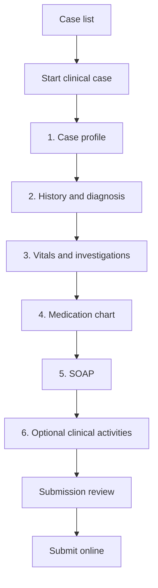

# Pharm.D Clinical Case Form Candidate 01

**Status:** Faculty review draft - not approved for implementation  
**Purpose:** First fixed native form for `DIRECT-DOCUMENTATION-IMPL-01`  
**Date:** 24 September 2026

## 1. Decision boundary

This is a candidate fixed form for the first Pharm.D clinical case workflow. It converts the useful parts of the Pharm.D-B.Pharm Nexus case flow into a safer, mobile-first Pharmalab form.

It does not introduce a form builder, curriculum data, dynamic rules, drug reference database, AI analysis, attachment upload, clinical calculators or clinical decision recommendations.

The implemented workflow remains:

> Authorized student starts case -> completes sections -> submits -> assigned faculty reviews -> returns or approves -> approved case appears in record history.

## 2. Reference decisions

| Reference pattern | Pharmalab decision |
| --- | --- |
| Nexus structured case journey | Adopt the section-based case flow. |
| Nexus patient/hospital identifiers | Reject. Standard form must not collect patient name, hospital IP/MRN number, phone, address, full DOB or government ID. |
| Nexus SOAP, medication, labs, counselling and intervention areas | Adopt as candidate educational sections; faculty decides which are mandatory. |
| Nexus ADR entry | Keep optional and only create data after the student deliberately saves it. Do not create a draft on page opening. |
| Nexus AI pre-submission analysis | Defer. Students and faculty remain responsible for clinical review. |
| Form.io multi-step and conditional patterns | Use only simple native Vue section navigation and bounded show/hide rules when faculty confirms a need. No executable JavaScript or general formula rules. |
| OpenMRS page/section/validation separation | Adopt the principle: form structure, client guidance and server validation must be tested as separate layers. |

## 3. Student mobile journey

The phone layout uses one section at a time, visible section progress, a persistent Save action and clear pending/offline/conflict status. The case does not submit automatically.

## 4. Candidate section catalogue

### 4.1 Case profile and de-identification

| Field | Candidate control | Candidate rule |
| --- | --- | --- |
| Educational case ID | Generated read-only value | Required; not a hospital identifier. |
| Age | Number plus unit or age band | Required; no full DOB. |
| Sex | Controlled option | Faculty to confirm option set and whether required. |
| Care setting | Controlled option or approved free text | Examples: ward/department only if it does not identify a patient. |
| Date of encounter | Date | Faculty/privacy policy confirms permitted precision. |
| Allergy status | Controlled option + optional detail | Allergy detail must not contain direct identifiers. |
| De-identification attestation | Checkbox | Required at online submission. |

### 4.2 Presenting complaint, history and diagnosis

| Field | Candidate control | Candidate rule |
| --- | --- | --- |
| Presenting complaint | Short/long text | Required; show de-identification guidance. |
| History of present illness | Long text | Required. |
| Relevant past medical history | Long text | Optional until faculty confirms. |
| Medication history | Repeatable medicine rows or narrative | Faculty selects the first-release approach. |
| Provisional/final diagnosis | Long text or controlled option | Faculty confirms required status and terminology approach. |

### 4.3 Vitals and investigations

| Field | Candidate control | Candidate rule |
| --- | --- | --- |
| Vitals | Bounded structured rows | Display unit beside every value; no unverified automatic interpretation. |
| Laboratory/investigation result | Repeatable structured rows | Test name, value, unit and collection date/time if approved. |
| Clinical interpretation | Long text | Student interpretation; not automated reference-range advice. |

The first release must not hard-code lab reference ranges or use them to generate clinical alerts. Faculty must approve any units, value boundaries or later reference sources.

### 4.4 Medication chart

Each medicine row is deliberately created by the student. Candidate fields:

| Field | Candidate control | Candidate rule |
| --- | --- | --- |
| Medicine name | Text with future controlled suggestion support | Required per row. |
| Strength and dose | Text/number with unit | Required per row. |
| Route | Controlled option | Required per row. |
| Frequency | Controlled option or text | Required per row. |
| Indication | Text | Optional until faculty confirmation. |
| Start/stop context | Text/date | Optional; no automatic reconciliation in first release. |

There is no drug-interaction, dose-adjustment or monograph recommendation in this form.

### 4.5 SOAP assessment and plan

| SOAP area | Candidate content |
| --- | --- |
| Subjective | Symptoms, history and relevant patient-reported information. |
| Objective | Relevant examination, vitals, investigations and medication facts. |
| Assessment | Student's clinical/pharmaceutical assessment. |
| Plan | Proposed monitoring, counselling, intervention or follow-up for faculty review. |

SOAP is a required visible section. It must not be merely advertised in navigation while absent from the actual form.

### 4.6 Optional clinical activities

The following are optional independent sections in Candidate 01. Faculty can make any of them mandatory later through an approved fixed-form revision.

| Section | Candidate data |
| --- | --- |
| Pharmacist intervention | Issue identified, recommendation, recipient/communication context, outcome/follow-up. |
| ADR observation | Suspected medicine, event description, timing, action taken and outcome. Naranjo is excluded. |
| Patient counselling | Topics discussed, key advice and follow-up need. |
| Monitoring/follow-up | Parameter, observation/plan and follow-up date if permitted. |

## 5. Native implementation rules

- Use existing Vue/Inertia form components and Laravel server validation.
- Use semantic labels, hint text and visible error messages; never rely on placeholder-only fields.
- Use stable machine keys for controls and labels separate from stored values where appropriate.
- Use bounded repeatable rows for medicines and investigations; enforce row limits.
- Treat client checks as guidance only; server validation is authoritative.
- Store the fixed `form_version` at case creation and include it in immutable submitted snapshots.
- Do not execute arbitrary expressions, JavaScript, API calls or calculations stored in the form definition.
- Do not auto-create ADR, intervention or counselling records merely because the student opens a screen.

## 6. Submission and review behaviour

Before online submission, show a read-only review screen with:

- section completion state;
- validation errors and missing required fields;
- de-identification attestation;
- exact fixed form version;
- explicit Submit action.

For the first implementation slice, faculty review uses a clear return reason and approval decision. Section-level or field-level comments, marks/rubrics, multiple reviewers and approved-case reopening remain separate decisions.

## 7. Faculty decisions required

| Decision | Recommended first-release default |
| --- | --- |
| Who starts a case? | Student starts one case only within an authorized rotation/assignment. |
| Mandatory sections | Case profile, presenting complaint/history, medication chart and SOAP. Faculty confirms vitals/investigations requirement. |
| Medication history format | Begin with repeatable medicine rows; permit narrative only where necessary. |
| Diagnosis terminology | Free text initially with clear instructional guidance; do not claim coding/standardization. |
| Vitals/lab units | Faculty-approved controlled units before release. |
| Optional activities | Intervention, ADR, counselling and monitoring remain optional in Candidate 01. |
| Review depth | Summary return reason and approval first; defer inline field comments/rubric. |
| Case completion/count rules | Do not enforce quotas in this gate. |

## 8. Acceptance criteria before implementation

- [ ] Pharm.D faculty approves, removes or changes every candidate section.
- [ ] Privacy owner confirms the de-identification boundary and allowed date precision.
- [ ] Faculty approves the first-release mandatory fields and permitted units.
- [ ] Faculty confirms the record-start rule and assigned reviewer relationship.
- [ ] The form contains no direct patient/hospital identifier field.
- [ ] ADR, intervention and counselling do not create drafts until deliberately saved.
- [ ] SOAP is present, required and visible in the implemented student route.
- [ ] No automated lab interpretation, drug interaction or AI recommendation is presented.
- [ ] Mobile, offline-draft, return/resubmission and authorization tests are added to the implementation gate.

## 9. Deferred from Candidate 01

- B.Pharm practical-record field set;
- attachments and images;
- Naranjo/WHO-UMC causality assessments;
- interaction checking, dose calculations and drug monographs;
- AI analysis or generated clinical recommendations;
- dynamic template building/publishing;
- curriculum/subject/year/semester data and automatic assignment;
- marks, rubric engine, multi-reviewer workflow and reporting.
